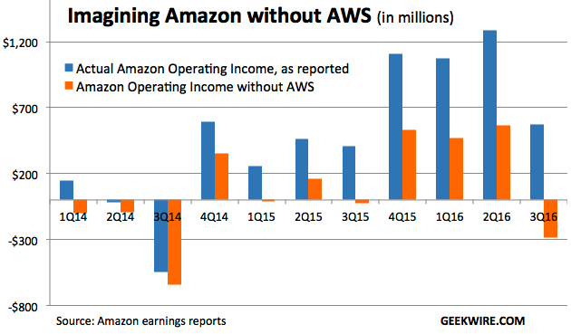
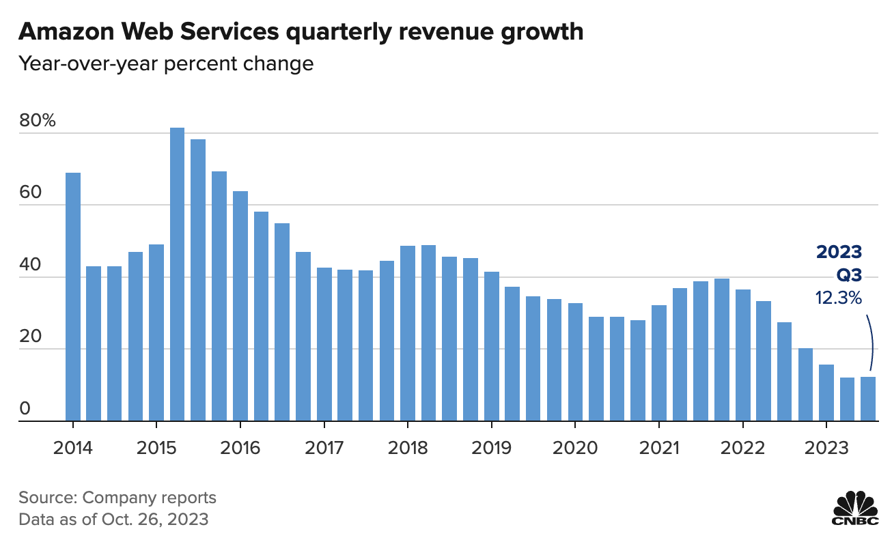
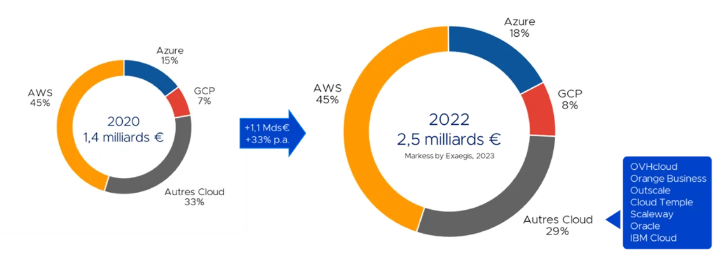

## Intro to Cloud Computing


<!--s-->

### What is the Cloud ?


<!--v-->


<!--v-->

But it's a bit bigger...


(Facebook's data center & server racks)

<!--v-->


Google Cloud Platform datacenters locations

<!--v-->

> The cloud is a real physical place - accessed over the internet - where a service is performed for you or where your stuff is stored. Your stuff is stored in the cloud, not on your device because the cloud is not on any device; the cloud lives in datacenters. A program running on your device accesses the cloud over the internet. The cloud is infinite, accessible from anywhere, at any time

**Todd Hoff in "Explain the Cloud like I'm 10"**

<!--s-->

### What about "Cloud Computing" ?


For us the cloud is a set of *cloud providers* renting *cloud services* 

which become increasingly "abstracted" from the hardware they run on...

<!--v-->

#### Services ?

- "Renting a server" ... (this is pure "cloud computing")
- "Replicated & Secure storage space" ...
- "Autoscaling deployment of a microservice" ...

<!--v-->


(a portion of aws services)

<!--v-->

#### How is it possible ?


The magic of... virtualization !

<!--v-->

#### Virtualization ?

> In computing, virtualization refers to the act of creating a virtual (rather than actual) version of something, including virtual computer hardware platforms, storage devices, and computer network resources.

Wikipedia

> Basically we are running software on "abstract hardware" which is a "portion" of a real computer ("bare metal")

<!--v-->


<!--v-->

Hardware visualisation: Server Example


<!--v-->


<!--v-->

#### Definitions

**Hypervisor** : A program for creating and running virtual machines. 

**Virtual Machine**: The emulated equivalent of a computer system that runs on top of another system

**Containers**: Isolated environments that share the same underlying OS & resources

<!--v-->

#### Hypervisor : KVM example (Kernel Virtual Machine)


<!--v-->

#### Nested Hypervisors : Google Compute Engine


<!--v-->

#### Consequence


> Any sufficiently advanced technology is indistinguishable from magic.

Clarke Third Law

<!--v-->

#### Hardware abstraction

- Hardware Abstraction ("download more RAM")
- Fine-grained resource allocation / sharing
- Decouple maintenance of hardware from maintenance of software

<!--v-->

#### Reliability, security...


<!--s-->

### Where does it come from ?


<!--v-->

Once upon a time...

Amazon (the e-commerce store) has "scaling" issues


<!--v-->

So basically Amazon became very good at *running* scalable infrastructure as *services*

- For themselves...
- ... but also for other partners (target)

And that infrastructure is often there to answer peak load...

<!--v-->

2002-2003; The idea

> Building an infrastructure that is completely standardized, completely automated, and relied extensively on web services for things like storage 

http://blog.b3k.us/2009/01/25/ec2-origins.html

<!--v-->

Let's sell it !


<!--v-->

#### How does Amazon can offer free shipping to everybody



<!--v-->

#### How does Amazon can offer free shipping to everybody



<!--s-->

### The many layers of Cloud Computing

<!--v-->

Hybrid Cloud ? Private Cloud ? Public Cloud ?


<!--v-->

Cloud providers are offering services with increasing layers of abstraction...

 <!-- .element: height="50%" width="50%" -->

<!--v-->


<!--v-->

#### Examples

- Renting a server with hard drive and storing data
- Using data storage service like google cloud storage without managing the infrastructure
- Using google drive

<!--v-->

#### Examples

- Renting a server with hard drive and storing data **IaaS**
- Using data storage service like google cloud storage without managing the infrastructure **PaaS**
- Using Dropbox **SaaS**

<!--v-->

#### Examples

- Renting a GPU farm to deploy your Large Language Model and serve it **IaaS**
- Using the HuggingFace API to serve predictions from your model **PaaS**
- Using ChatGPT **SaaS**

<!--v-->

#### It gets harder

  <!-- .element: height="50%" width="50%" -->

<!--v-->

  <!-- .element: height="50%" width="50%" -->


<!--s-->

### Public Cloud Providers

<!--v-->

  <!-- .element: height="50%" width="50%" -->

<!--v-->

AI Cloud Providers

  <!-- .element: height="50%" width="50%" -->

- https://www.paperspace.com/core
- https://lambdalabs.com/
- https://huggingface.co/hardware

<!--v-->

🐓🧀🐸🇫🇷


OVH went public in 2021

Scaleway is leading the charge for AI in France (& Europe)

<!--v-->

🐓🧀🐸🇫🇷

[Thales Cloud Souverain](https://thales-group.prezly.com/thales-et-google-cloud-annoncent-un-partenariat-strategique-pour-developper-conjointement-un--cloud-de-confiance--en-france#)

[OVH x Google Cloud](https://corporate.ovhcloud.com/fr/newsroom/news/ovhcloud-and-google-cloud-announce-strategic-partnership-co-build-trusted-cloud-solution-europe/)

[Scaleway et l'IA](https://www.lemonde.fr/economie/article/2023/09/26/xavier-niel-annonce-des-investissements-strategiques-dans-l-ia_6191008_3234.html)

<!--v-->

🇪🇺 GAIA-X : Cloud Federation in Europe

[https://www.data-infrastructure.eu/GAIAX/](https://www.data-infrastructure.eu/GAIAX/)

[https://www.contexte.com/article/tech/gaia-x-souverainete-cloud_150712.html](https://www.contexte.com/article/tech/gaia-x-souverainete-cloud_150712.html)

<!--v-->


<!--v-->

 <!-- .element: height="50%" width="50%" -->

[source](https://www.larevuedudigital.com/le-marche-du-cloud-concentre-en-france-entre-amazon-microsoft-et-google/)

<!--s-->

### Cloud Computing & Environment


<!--v-->

I am not competent to say anything about this. Some sources

- The Shift Project : https://theshiftproject.org/article/deployer-la-sobriete-numerique-rapport-shift/
- Scaleway : https://www.scaleway.com/fr/leadership-environnemental/
- Google : https://cloud.google.com/sustainability
- Earth.org : https://earth.org/environmental-impact-of-cloud-computing/

<!--s-->

## "Using" the Cloud


<!--v-->

### Cloud Computing: A technical *evolution*

- More Virtualization
- More API
- More Managed Services

<!--v-->

### Cloud Computing: A usage **revolution**

<!--v-->

#### Autonomy : access to computing power

- Outsourcing infra, maintenance, security, development of new services
- Pay-per-use with "Infinitely scalable" infrastructure
- "No need to plan out" infrastructure
  - Enabling innovation
  - Power in the hands of developpers/builders

<!--v-->

#### Changing the way we interact with hardware

We interact with cloud providers using APIs...

```bash
gcloud compute --project=deeplearningsps instances create ${INSTANCE_NAME} \
    --zone=${ZONE} \
    --machine-type=n1-standard-8 \
    --scopes=default,storage-rw,compute-rw \
    --maintenance-policy=TERMINATE \
    --image-family=ubuntu-1804-lts \
    --image-project=ubuntu-os-cloud \
    --boot-disk-size=200GB \
    --boot-disk-type=pd-standard \
    --accelerator=type=nvidia-tesla-p100,count=1 \
    --metadata-from-file startup-script=startup_script.sh
```

<!--v-->

#### Before...


<!--v-->

#### After...

```yaml
resources:
- name: vm-created-by-deployment-manager
  type: compute.v1.instance
  properties:
    zone: us-central1-a
    machineType: zones/us-central1-a/machineTypes/n1-standard-1
    disks:
    - deviceName: boot
      type: PERSISTENT
      boot: true
      autoDelete: true
      initializeParams:
        sourceImage: projects/debian-cloud/global/images/family/debian-9
    networkInterfaces:
    - network: global/networks/default
```

<!--v-->

#### Infrastructure as Code

- Infra is now managed via text files
- Data is securely stored on storage
- So we store code + urls on git... and everything is reproducible !
- We use automated deployment tools (terraform, gcp deployment manager...)

<!--v-->

#### Pet vs Cattle


<!--v-->

### Let's discuss

<!--v-->

**Is using cloud computing less expensive ?**

- 👍 Depend on your {normal / peak} utilization
- 👍 Access to latest hardware without investment
- 👎 Fully utilized hardware is more expensive on the cloud
- 👎 CLOUD HYGIENE !
  - Watch for unused services / storage
  - Shutdown machines when not used
  - Services stack up...

<!-- .element: class="fragment" -->

<!--v-->

**Is using cloud computing more secure / safer ?**

- 👍 The best engineers in the world working on it
- 👍 Secure regions / private cloud...
- 👎 Your data somewhere in some datacenter...
- 👎 "Dependency" towards your cloud provider...

<!-- .element: class="fragment" -->

<!--s-->

#### Fully virtual development environment

<!--v-->


<!--v-->

#### [Github Codespaces](https://docs.github.com/en/codespaces/overview)

* [Github Codespaces](https://docs.github.com/en/codespaces) : A managed development environment by Microsoft Azure
* A virtual machine and a [containerized development environment](https://docs.github.com/en/codespaces/setting-up-your-project-for-codespaces/adding-a-dev-container-configuration/introduction-to-dev-containers)
* A lot of built-in bonuses including "in-browser" connection & TCP port forwarding with reverse proxy

  <!-- .element: height="50%" width="50%" -->

<!--v-->

#### Remote Development : Your future daily routine

  <!-- .element: height="50%" width="50%" -->

[Uber Blog describing their way of working](https://www.uber.com/en-FR/blog/devpod-improving-developer-productivity-at-uber/)

<!--s-->

### Cloud usage, some anecdotes

<!--v-->

#### Big Tech public cloud bills

- Apple in 2019 [350m$ on AWS / year](https://www.theverge.com/2019/4/22/18511148/apple-icloud-cloud-services-amazon-aws-30-million-per-month)
- Spotify in 2018 [150m$ on GCP / year](https://www.cnbc.com/2018/03/20/spotify-will-spend-nearly-450-million-on-google-cloud-over-3-years.html)
- Lyft in 2019 [100m$ on AWS / year](https://www.cnbc.com/2019/03/01/lyft-plans-to-spend-300-million-on-aws-through-2021.html)

<!--v-->

#### Pokemon Go Launch (2016)


[source](https://cloud.google.com/blog/products/gcp/bringing-pokemon-go-to-life-on-google-cloud)

<!--v-->

#### Doctolib (2021)


[source](https://medium.com/doctolib/monday-july-12-at-doctolib-a-retrospective-9ac15c46ac19)

<!--v-->

#### Facebook October 2021 Failure


https://blog.cloudflare.com/october-2021-facebook-outage/

<!--v-->

#### AWS US-EAST-1 Failure (2022)

> 13 June 2023: AWS. The largest AWS region (us-east-1) degraded heavily for 3 hours, impacting 104 AWS services. A joke says that when us-east-1 sneezes the whole world feels it, and this was true: Fortnite matchmaking stopped working, McDonalds and Burger King food orders via apps couldn’t be made, and customers of services like Slack, Vercel, Zapier and many more all felt the impact. (incident details). We did a deepdive into this incident earlier in AWS’s us-east-1 outage.

https://aws.amazon.com/message/12721/

<!--v-->

#### Links

<http://highscalability.com>

<http://highscalability.com/all-time-favorites>

[Netflix: What happens when you press play - 2017](http://highscalability.com/blog/2017/12/11/netflix-what-happens-when-you-press-play.html)

[Mind boggling statistics on Amazon Prime Day](https://aws.amazon.com/blogs/aws/amazon-prime-day-2019-powered-by-aws/)

<!--s-->

## Cloud Computing & AI : What does it mean for YOU ?


<!--v-->


<!--v-->


<!--v-->

#### Your mileage may vary

depending on:

- Your company
- Your role

but you will "deal with" cloud computing one way or another !

<!--v-->

#### Personal experience

- What do I use ?
- Why do I use it ?
- How do I do ?

<!--v-->

## Very quick intro to MLOps

<!--v-->

 <!-- .element: height="40%" width="40%" -->

<!--v-->

  <!-- .element: height="50%" width="50%" -->

<!--v-->

 <!-- .element: height="50%" width="50%" -->

<!--v-->

### Layers of "enabling technology"

 <!-- .element: height="75%" width="75%" -->

<!--v-->

- https://huyenchip.com/machine-learning-systems-design/toc.html
- https://ml-ops.org/content/references.html

<!--v-->

### My usage : Flexibility


<!--v-->

### A full workflow 


<!--v-->

### All about that scale

[BLOOM: A 176B-Parameter Open-Access Multilingual Language Model](https://arxiv.org/pdf/2211.05100)

> Training BLOOM took about 3.5 months to complete and consumed 1,082,990 compute hours. Training was conducted on 48 nodes, each having 8 NVIDIA A100 80GB GPUs (a total of 384 GPUs);

<!--v-->

### AI Distributed Computing


<!--v-->

### Stable Diffusion

 <!-- .element: height="60%" width="60%" -->

[Stable Diffusion Training Times](https://www.mosaicml.com/blog/training-stable-diffusion-from-scratch-costs-160k)

<!--v--> 

### AI Cloud Providers

  <!-- .element: height="50%" width="50%" -->

<!--v-->

### The need for tech

  <!-- .element: height="50%" width="50%" -->

And dask !

<!--s-->

## Google Cloud Platform


<!--v-->

- One of the main cloud provider
- Behind AWS in SaaS (serverless...)
- More "readable" product line (for a Cloud Provider...)
- Very good "virtual machine" management  
  * per second billing
  * fine-grained resource allocation

<!--v-->


<!--v-->


<!--v-->

### Concepts

<!--v-->

#### Zones and Regions


<!--v-->

#### Projects


- Access (Enabling API/Services)
- Ressources (Quota by project)
- Networking
- Billing

<!--v-->

#### Concepts: Identity and Access Management (IAM)


<!--v-->

#### Main Products we are going to be looking at

- Google Compute Engine (virtual machine solutions)
- Google Cloud Storage (storage solutions)

<!--v-->

#### Google Compute Engine (GCE)

- The VM solution for GCP
- Images: Boot disks for VM instances
    example:  `ubuntu-1804`
- Machine Types: Ressources available to your instance
    example: `n1-standard-8` (8 vCPU, 30 Gb RAM)
- Storage Options: "Attached disk" that can persist once the instance is destroyed... can be HDD, SDD...
- Preemptible: "Spot instances" on AWS", cheap but can be killed any minute by GCP

<!--v-->

#### Google Cloud Storage (GCS)

- Cheaper storage than persistent disks
- Can be shared between multiple instances / zones
- Higher latency
- Several types of storage (w/ different r/w costs & performance)
- Data is stored in "buckets" **whose name are globally unique**

<!--v-->

#### Interacting with GCP: The Console


<https://console.cloud.google.com>

<!--v-->

#### Interacting with GCP: SDK & Cloud Shell

- Using the gcloud CLI: https://cloud.google.com/sdk/install
- Using Google Cloud Shell: A small VM instance you can connect to with your browser (that we won't use)


<!--s-->

### Self-paced hands-on


<!--v-->

#### Objectives

- Create your GCP account, configure your credentials
- Connect to github Codespace
- Creating your first VMs and connect to it via SSH
- Interaction with Google Cloud Storage

<!--v-->

#### SSH Tunnel, Port Forwarding

> In computer networking, **a port is a communication endpoint**. At the software level, within an operating system, a port is a logical construct that identifies a specific process or a type of network service. **A port is identified for each transport protocol and address combination** by a 16-bit unsigned number, known as the port number. The most common transport protocols that use port numbers are the Transmission Control Protocol (TCP) and the User Datagram Protocol (UDP).

[Wikipedia](https://en.wikipedia.org/wiki/Port_(computer_networking))

<!--v-->

#### Examples of protocols & usual ports

Examples

* SSH on port 22
* HTTP on port 80
* HTTPS on port 443

http apps can serve content over specific ports

Example

* Jupyter default is 8888 (that's why you open http://localhost:8888)

<!--v-->

#### SSH Tunnels

We usually connect to web app using `http://{ip}:{port}`

😨 but what if the machine is not available from the public internet / local network ?

➡️ Enter SSH with port forwarding

  <!-- .element: height="50%" width="50%" -->

[Visual guide](https://iximiuz.com/en/posts/ssh-tunnels/)

<!--v-->

#### Github Codespaces


https://docs.github.com/en/codespaces/overview

<!--v-->

#### Tunnels of tunnels

* Some of you did Local Machine -> (browser) -> Codespace -> (ssh) -> VM -> Jupyterlab on port 8888
* With port transfers !
* What happens when you go to `http://(url-generated-by-codespaces):8888` in this case ?


<!--v-->

#### Demo

- Google Compute Engine Interface
- Github Codespaces

