## Intro to Cloud Computing


<!--v-->

### What is the Cloud ?

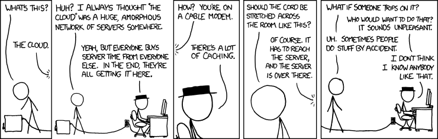

<!--v-->

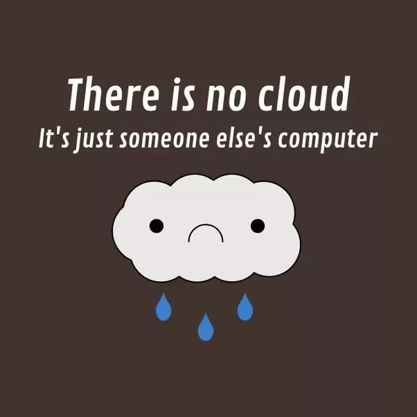

<!--v-->

But it's a bit bigger...

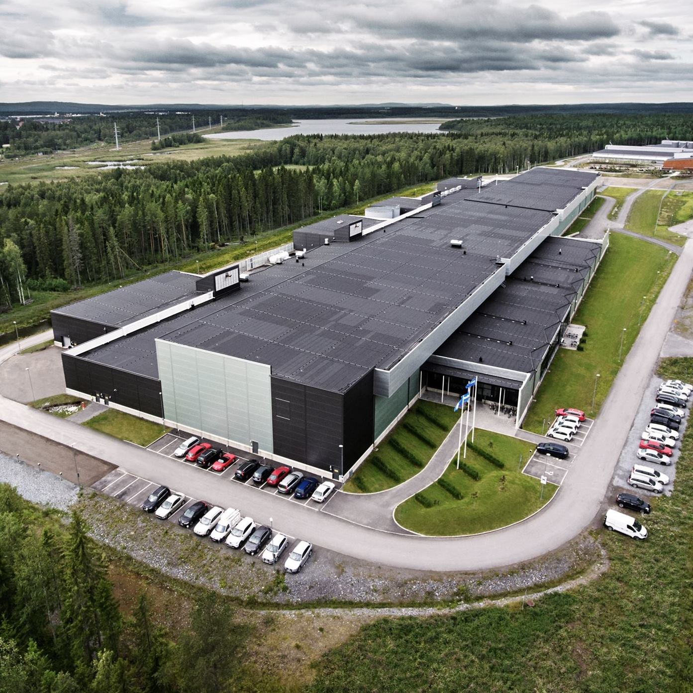

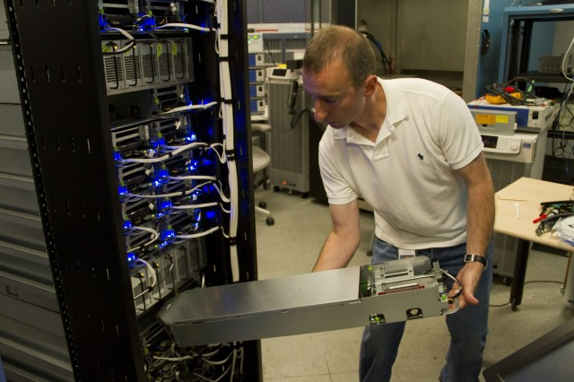

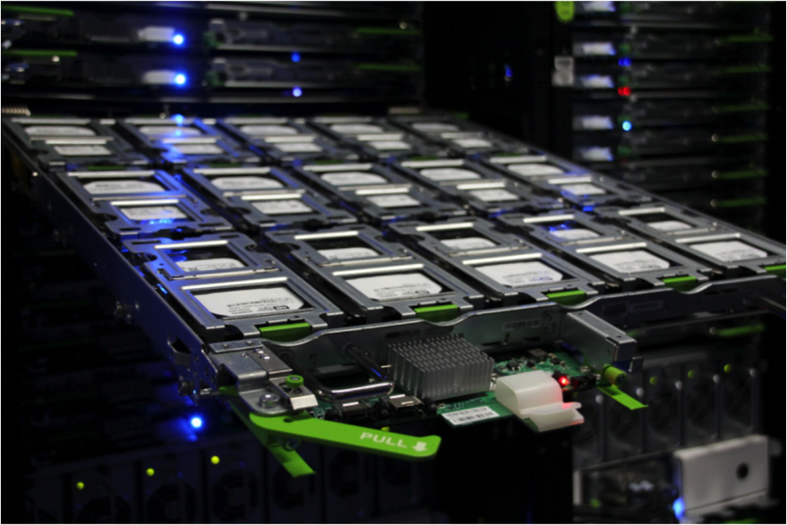

(Facebook's data center & server racks)

<!--v-->


Google Cloud Platform datacenters locations

<!--v-->

> The cloud is a real physical place - accessed over the internet - where a service is performed for you or where your stuff is stored. Your stuff is stored in the cloud, not on your device because the cloud is not on any device; the cloud lives in datacenters. A program running on your device accesses the cloud over the internet. The cloud is infinite, accessible from anywhere, at any time

**Todd Hoff in "Explain the Cloud like I'm 10"**

<!--v-->

### What about "Cloud Computing" ?

For us the cloud is a set of *cloud providers* renting *cloud services* 

which become increasingly "abstracted" from the hardware they run on...

<!--v-->

#### Services ?

- "Renting a server" ... (this is pure "cloud computing")
- "Replicated & Secure storage space" ...
- "Autoscaling deployment of a microservice" ...

<!--v-->

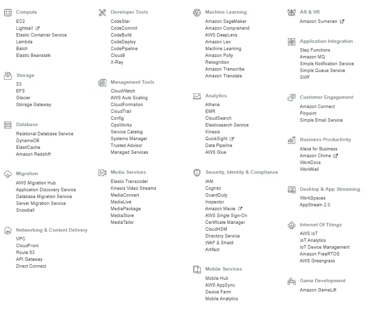

(a portion of aws services)

<!--v-->

#### How is it possible ?


The magic of... virtualization !

<!--v-->

#### Virtualization ?

> In computing, virtualization refers to the act of creating a virtual (rather than actual) version of something, including virtual computer hardware platforms, storage devices, and computer network resources.

Wikipedia

> Basically we are running software on "abstract hardware" which is a "portion" of a real computer ("bare metal")

<!--v-->

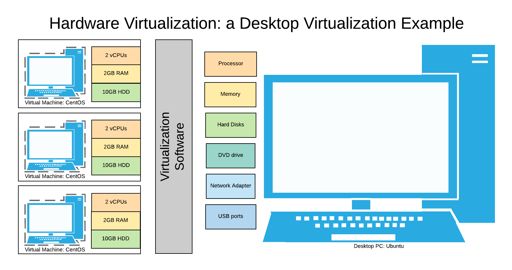

<!--v-->

Hardware visualisation: Server Example

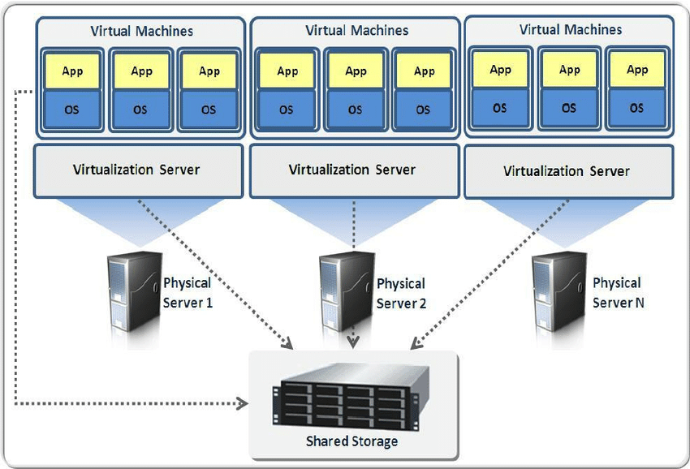

<!--v-->

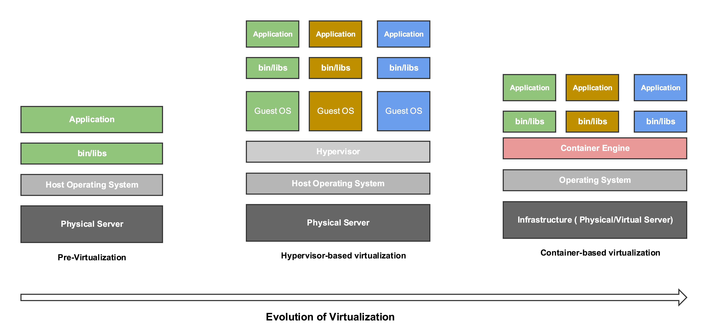

<!--v-->

#### Definitions

**Hypervisor** : A program for creating and running virtual machines. 

**Virtual Machine**: The emulated equivalent of a computer system that runs on top of another system

**Containers**: Isolated environments that share the same underlying OS & resources

<!--v-->

#### Hypervisor : KVM example (Kernel Virtual Machine)

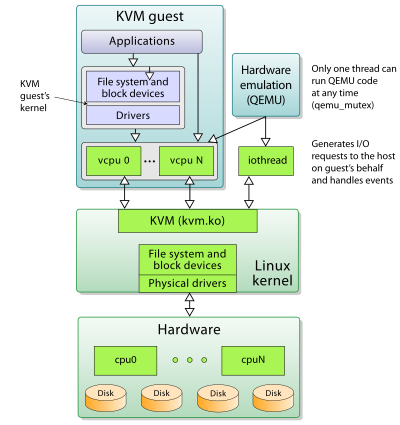 <!-- .element: height="30%" width="30%" -->

<!--v-->

#### Nested Hypervisors : Google Compute Engine

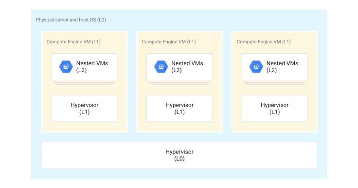 <!-- .element: height="30%" width="30%" -->

<!--v-->

#### Consequence


> Any sufficiently advanced technology is indistinguishable from magic.

Clarke Third Law

<!--v-->

#### Hardware abstraction

- Hardware Abstraction ("download more RAM")
- Fine-grained resource allocation / sharing
- Decouple maintenance of hardware from maintenance of software

<!--v-->

#### Reliability, security...

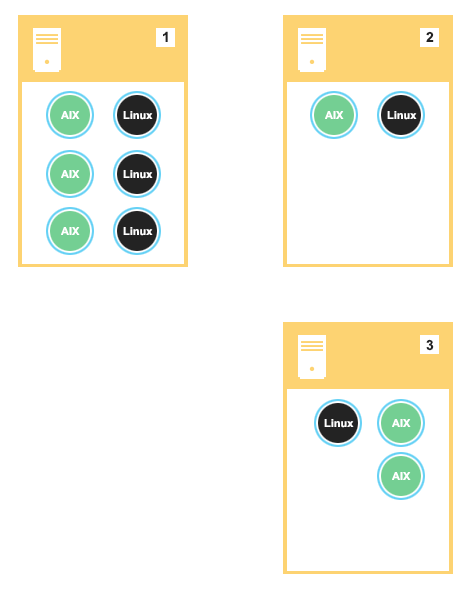

<!--s-->

### Where does it come from ?

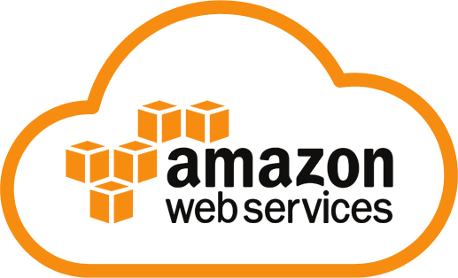

<!--v-->

Once upon a time...

Amazon (the e-commerce store) has "scaling" issues

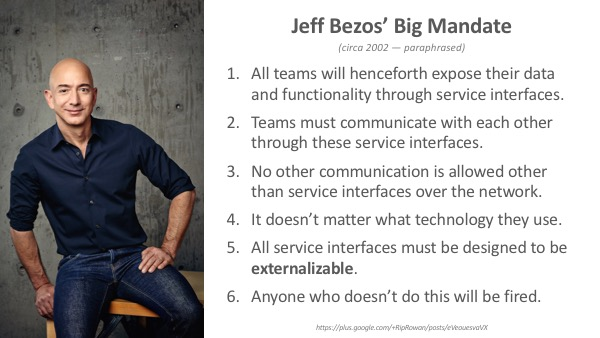

<!--v-->

So basically Amazon became very good at *running* scalable infrastructure as *services*

- For themselves...
- ... but also for other partners (target)

And that infrastructure is often there to answer peak load...

<!--v-->

2002-2003; The idea

> Building an infrastructure that is completely standardized, completely automated, and relied extensively on web services for things like storage 

http://blog.b3k.us/2009/01/25/ec2-origins.html

<!--v-->

Let's sell it !

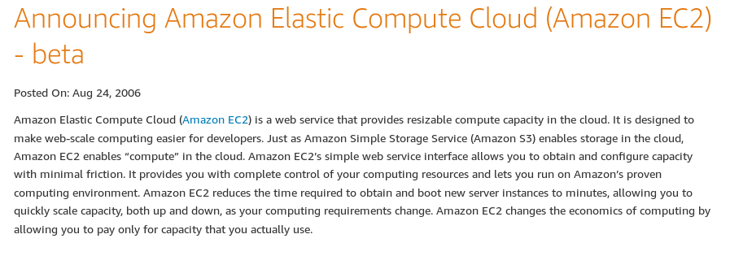

<!--v-->

#### How does Amazon can offer free shipping to everybody

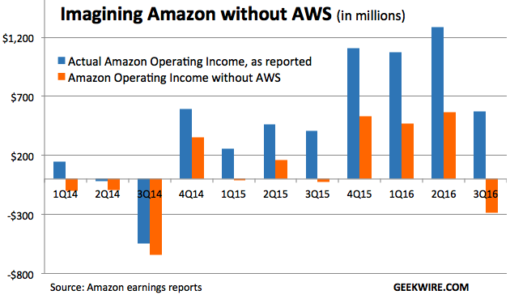

<!--v-->

#### How does Amazon can offer free shipping to everybody

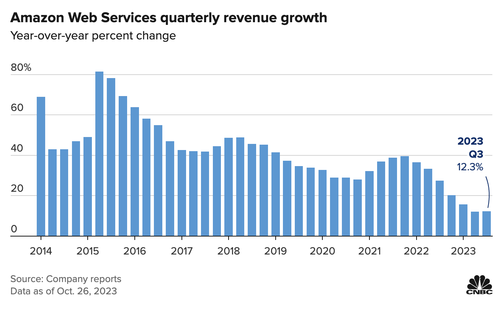

<!--s-->

### The many layers of Cloud Computing

<!--v-->

Hybrid Cloud ? Private Cloud ? Public Cloud ?

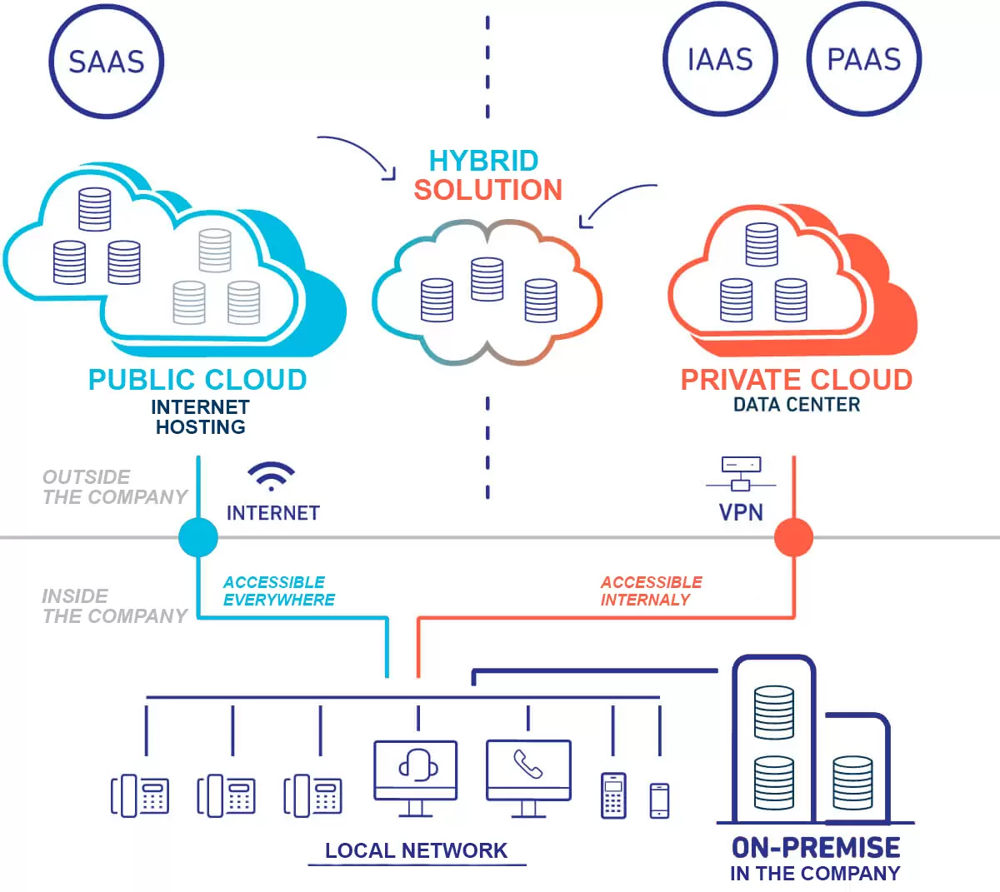

<!--v-->

Cloud providers are offering services with increasing layers of abstraction...

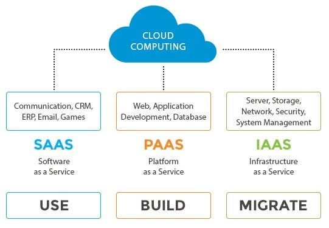 <!-- .element: height="50%" width="50%" -->

<!--v-->

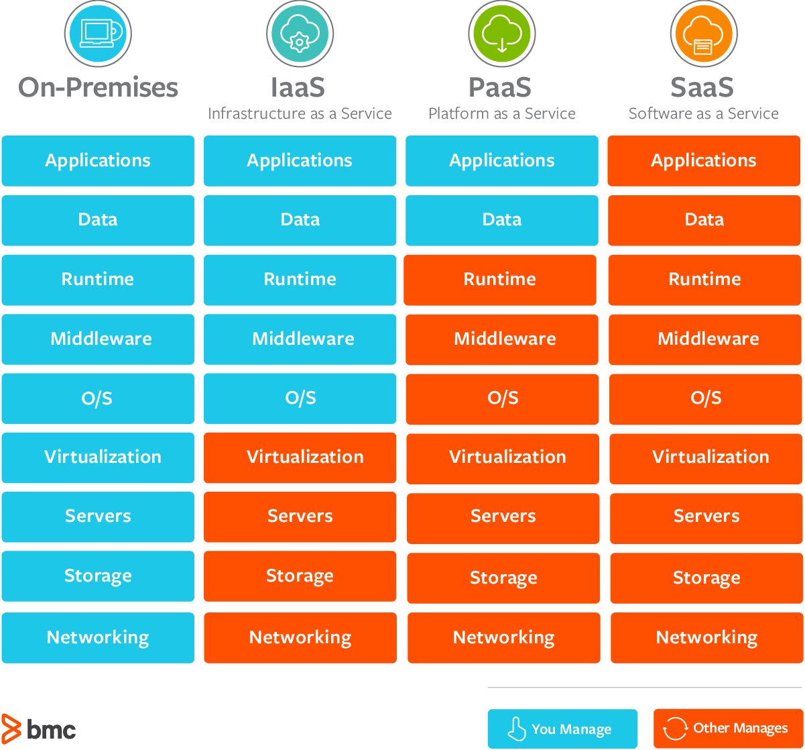

<!--v-->

#### Examples

- Renting a server with hard drive and storing data
- Using data storage service like google cloud storage without managing the infrastructure
- Using google drive

<!--v-->

#### Examples

- Renting a server with hard drive and storing data **IaaS**
- Using data storage service like google cloud storage without managing the infrastructure **PaaS**
- Using Dropbox **SaaS**

<!--v-->

#### Examples

- Renting a GPU farm to deploy your Large Language Model and serve it **IaaS**
- Using the HuggingFace API to serve predictions from your model **PaaS**
- Using ChatGPT **SaaS**

<!--v-->

#### It gets harder

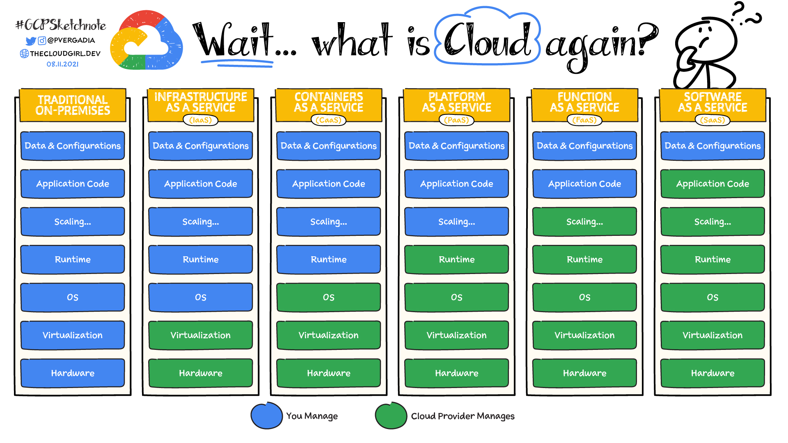  <!-- .element: height="65%" width="65%" -->

<!--v-->

#### Useful analogy (1)

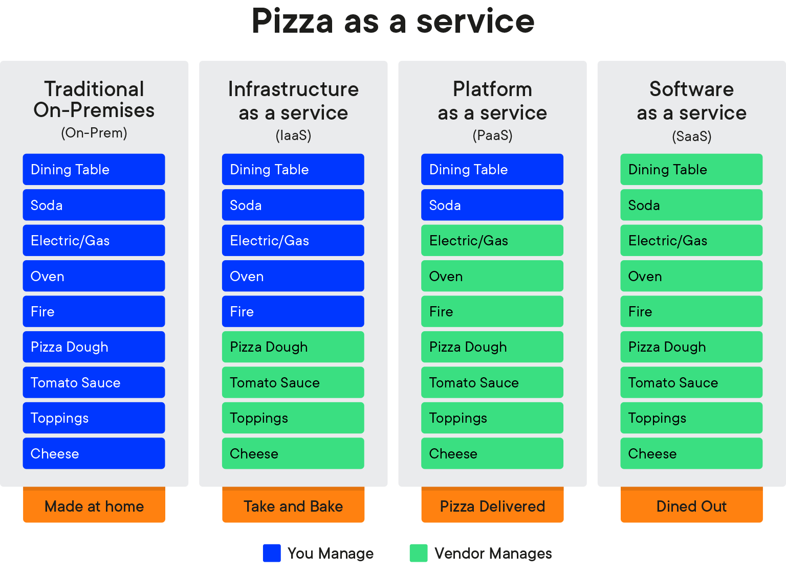  <!-- .element: height="50%" width="50%" -->

<!--v-->

#### Useful analogy (2)

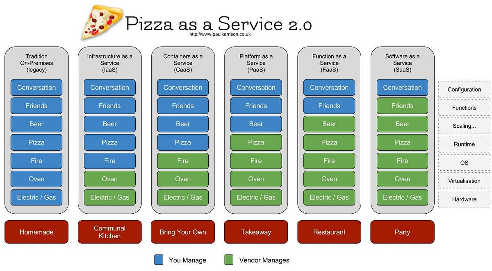  <!-- .element: height="50%" width="50%" -->

<!--s-->

### Public Cloud Providers

<!--v-->

#### Major cloud providers

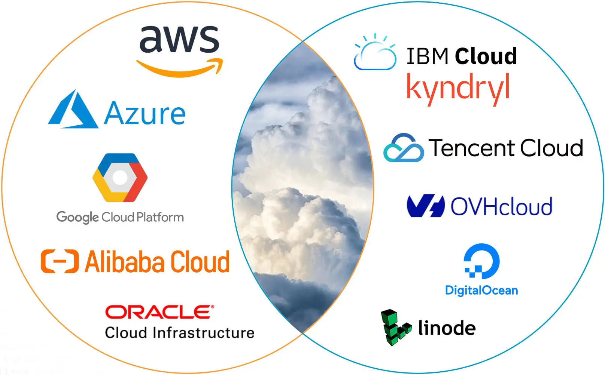  <!-- .element: height="50%" width="50%" -->

<!--v-->

#### Private Cloud Stack


<!--v-->

#### AI Cloud Providers

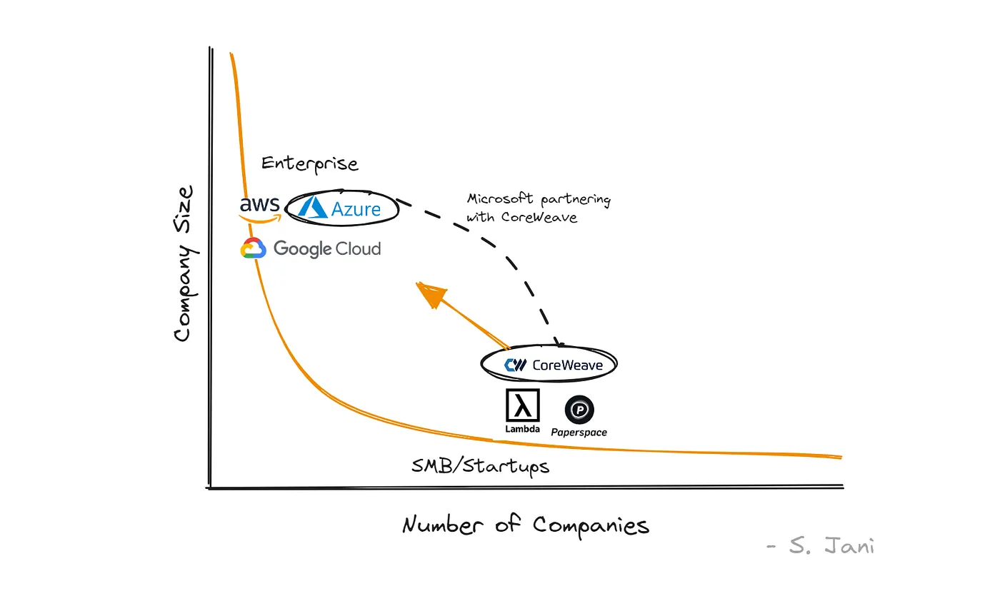  <!-- .element: height="50%" width="50%" -->

- https://www.paperspace.com/core
- https://lambdalabs.com/
- https://huggingface.co/hardware

<!--v-->

#### French Cloud Providers 🐓🧀🐸🇫🇷

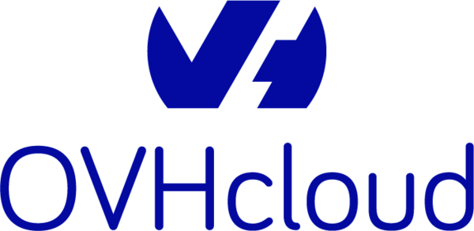


- OVH went public in 2021
- Scaleway is leading the charge for AI in France (& Europe)
- Outscale is focusing on SecNumCloud
- BleuCloud is CapGemini x Orange

<!--v-->

#### US dependency ?

**Cloud Act** : a US law that allows US authorities to compel US-based tech companies to provide data stored on their servers.

Even if that data is physically located outside the United States.

**SecNumCloud** :  SecNumCloud est une qualification délivrée par l’ANSSI, autorité nationale de cybersécurité, attestant qu’un service de cloud présente un haut niveau de sécurité, adapté aux usages sensibles de l’Etat et des entreprises françaises. 

[SecNumCloud en pas si bref](https://www.linkedin.com/pulse/secnumcloud-en-pas-si-bref-vincent-strubel-505ge/)

<!--v-->

#### US dependency ?

| Project | Partners | Tech | Status |
|:---:|---|---|---|
| Bleu | Orange + Capgemini (100% French ownership), <br>Microsoft as tech partner (not shareholder) | Azure + M365 | Commercial operations launched 2024.<br>First clients include EDF, Dassault Aviation. |
| S3NS. | Thales (majority) <br>Google Cloud (minority shareholder, <24%) | GCP | SecNumCloud 3.2 obtained December 2024.<br>Offers IaaS/PaaS/CaaS |

<!--v-->

🇪🇺 GAIA-X : Cloud Federation in Europe

[https://www.data-infrastructure.eu/GAIAX/](https://www.data-infrastructure.eu/GAIAX/)

[https://www.contexte.com/article/tech/gaia-x-souverainete-cloud_150712.html](https://www.contexte.com/article/tech/gaia-x-souverainete-cloud_150712.html)

<!--v-->

#### Cloud Market Share (World)

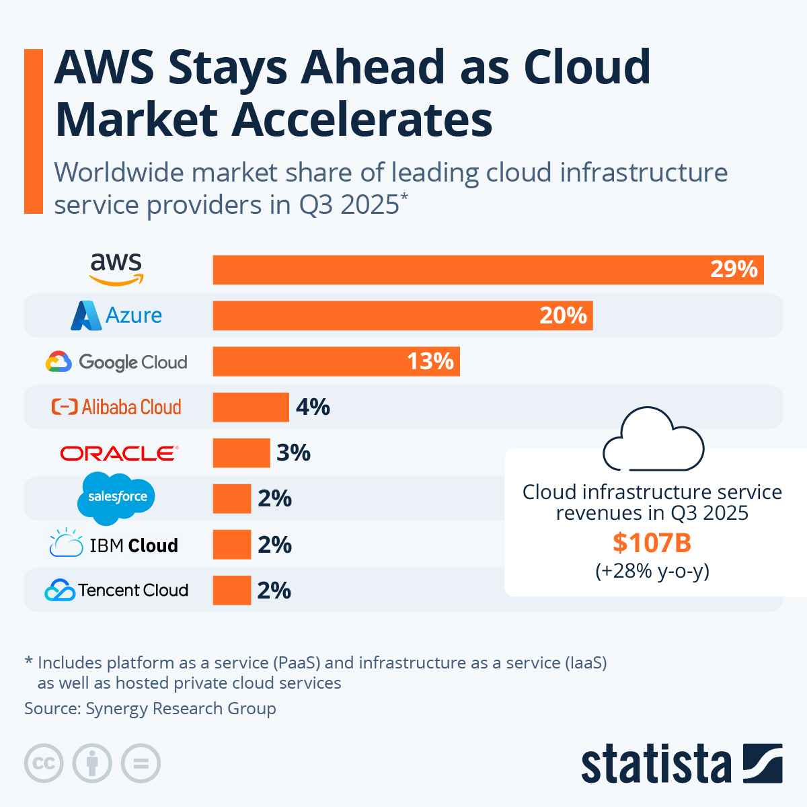 <!-- .element: height="40%" width="40%" -->

[source, 2025](https://www.statista.com/chart/18819/worldwide-market-share-of-leading-cloud-infrastructure-service-providers/)

<!--v-->

#### Cloud Market Share (Europe)

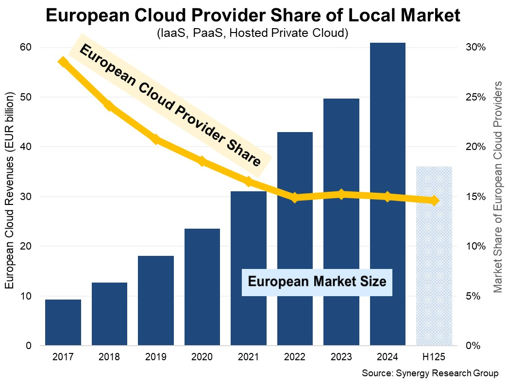  <!-- .element: height="40%" width="40%" -->

[source, 2025](https://www.srgresearch.com/articles/european-cloud-providers-local-market-share-now-holds-steady-at-15)

<!--v-->

#### Cloud Market Share (France)

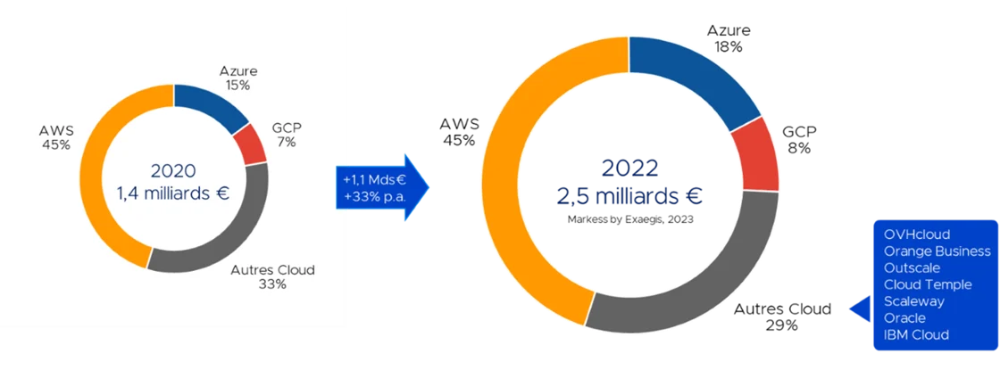 <!-- .element: height="50%" width="50%" -->

[source, 2021](https://www.larevuedudigital.com/le-marche-du-cloud-concentre-en-france-entre-amazon-microsoft-et-google/)

<!--s-->

### Cloud Computing & Environment

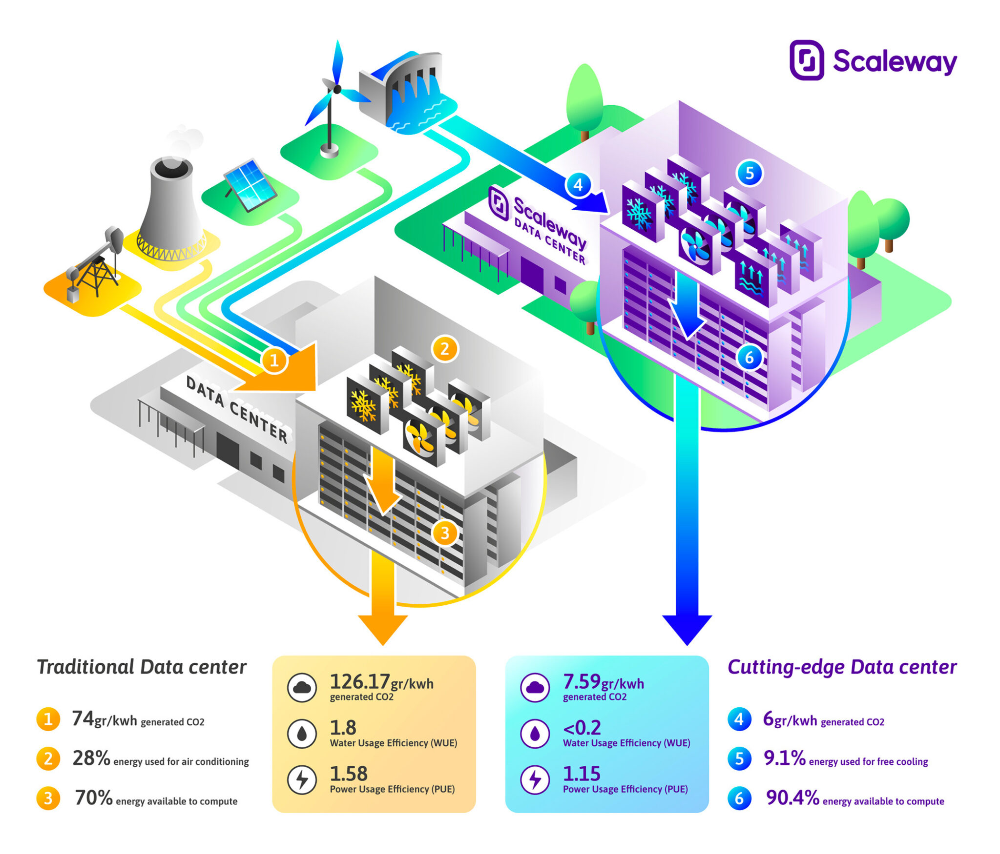

<!--v-->

I am not competent to say anything about this. Some sources

- The Shift Project : https://theshiftproject.org/article/deployer-la-sobriete-numerique-rapport-shift/
- Scaleway : https://www.scaleway.com/fr/leadership-environnemental/
- Google : https://cloud.google.com/sustainability
- Earth.org : https://earth.org/environmental-impact-of-cloud-computing/

<!--v-->

On "Artificial Intelligence" & sustainability, entry points

- [Power Hungry Processing: Watts Driving the Cost of AI Deployment?](https://arxiv.org/abs/2311.16863)
- [ The Environmental Impacts of AI -- Primer ](https://huggingface.co/blog/sasha/ai-environment-primer)

<!--s-->

## "Using" the Cloud

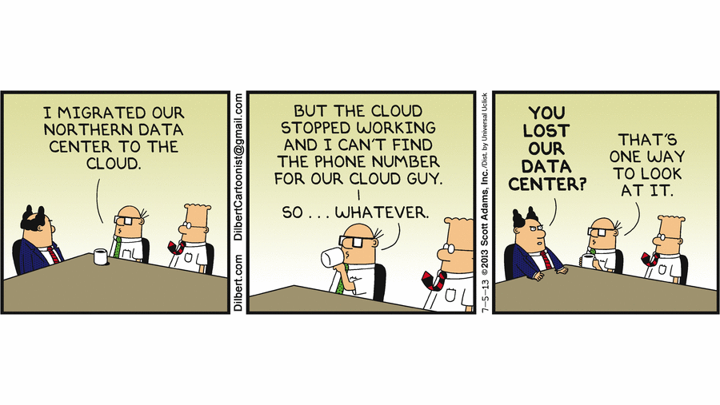

<!--v-->

### Cloud Computing: A technical *evolution*

- More Virtualization
- More API
- More Managed Services

<!--v-->

### Cloud Computing: A usage **revolution**

<!--v-->

#### Autonomy : access to computing power

- Outsourcing infra, maintenance, security, development of new services
- Pay-per-use with "Infinitely scalable" infrastructure
- "No need to plan out" infrastructure
  - Enabling innovation
  - Power in the hands of developpers/builders

<!--v-->

#### Changing the way we interact with hardware

We interact with cloud providers using APIs...

```bash
gcloud compute --project=deeplearningsps instances create ${INSTANCE_NAME} \
    --zone=${ZONE} \
    --machine-type=n1-standard-8 \
    --scopes=default,storage-rw,compute-rw \
    --maintenance-policy=TERMINATE \
    --image-family=ubuntu-1804-lts \
    --image-project=ubuntu-os-cloud \
    --boot-disk-size=200GB \
    --boot-disk-type=pd-standard \
    --accelerator=type=nvidia-tesla-p100,count=1 \
    --metadata-from-file startup-script=startup_script.sh
```

<!--v-->

#### Before...

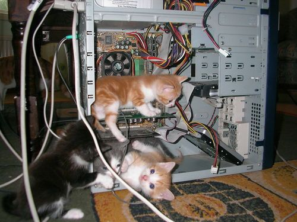

<!--v-->

#### After...

```yaml
resources:
- name: vm-created-by-deployment-manager
  type: compute.v1.instance
  properties:
    zone: us-central1-a
    machineType: zones/us-central1-a/machineTypes/n1-standard-1
    disks:
    - deviceName: boot
      type: PERSISTENT
      boot: true
      autoDelete: true
      initializeParams:
        sourceImage: projects/debian-cloud/global/images/family/debian-9
    networkInterfaces:
    - network: global/networks/default
```

<!--v-->

#### Infrastructure as Code

- Infra is now managed via text files
- Data is securely stored on storage
- So we store code + urls on git... and everything is reproducible !
- We use automated deployment tools (terraform, gcp deployment manager...)

<!--v-->

#### Pet vs Cattle

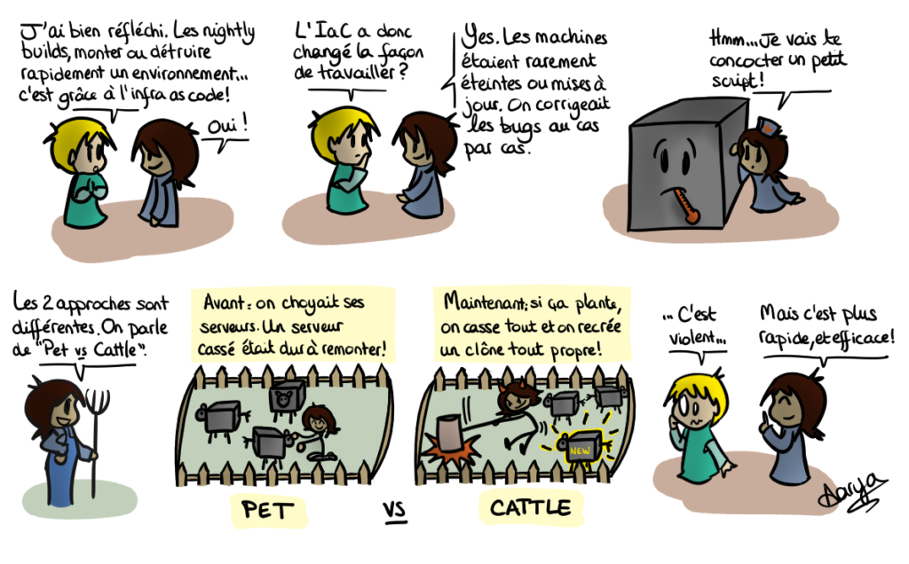

<!--v-->

#### Cloud Native Computing Foundation

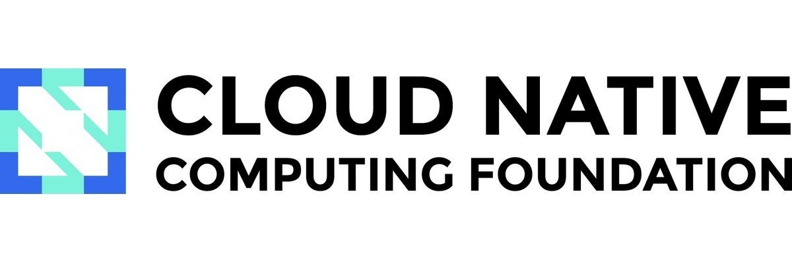

<!--v-->

#### Cloud Native Computing Foundation


<!--v-->

### Let's discuss

<!--v-->

**Is using cloud computing less expensive ?**

- 👍 Depend on your {normal / peak} utilization
- 👍 Access to latest hardware without investment
- 👎 Fully utilized hardware is more expensive on the cloud
- 👎 CLOUD HYGIENE !
  - ⚠️ Watch for unused services / storage
  - ⚠️ Shutdown machines when not used
  - ⚠️ Services stack up...

<!-- .element: class="fragment" -->

<!--v-->

**Is using cloud computing more secure / safer ?**

- 👍 The best engineers in the world working on it
- 👍 Secure regions / private cloud...
- 👎 Your data somewhere in some datacenter...
- 👎 "Dependency" towards your cloud provider...

<!-- .element: class="fragment" -->

<!--s-->

### Cloud Native Culture example : Object Storage

<!--v-->

#### File Storage vs Object Storage

| Aspect | File Storage | Object Storage |
|---|---|---|
| Model | Hierarchical directories and files | Buckets and objects (flat namespace) |
| Access | Mount as network drive, POSIX (NFS/SMB) | HTTP API (REST) |
| Use case | Shared storage, legacy apps, home directories | Data lakes, ML datasets, backups |
| Scalability | Limited to file system capacity | Built with scale in mind (abstraction over the storage location) |

<!--v-->

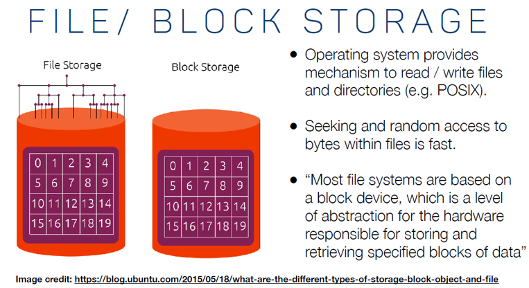
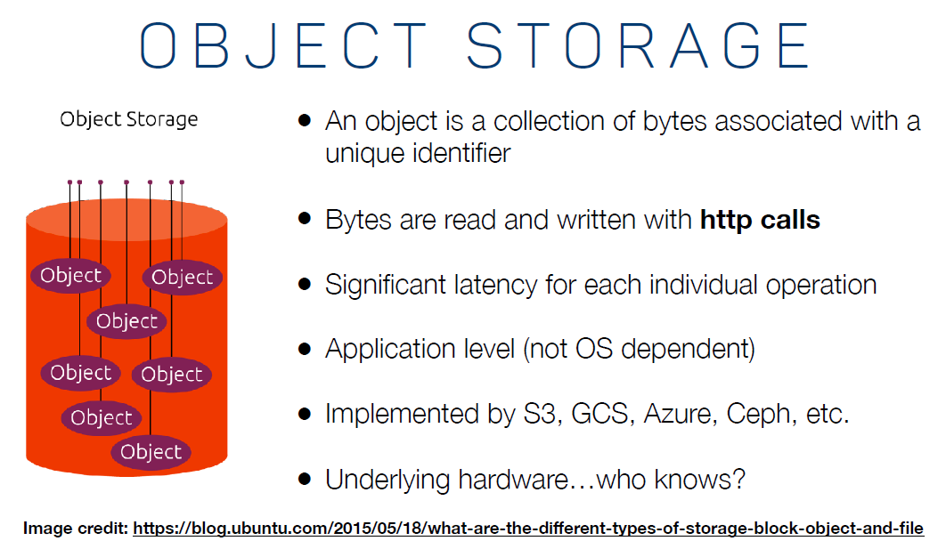

<!--v-->

#### Object Storage Model

- **Bucket**: Container for objects (like a top-level folder)
- **Object**: File + metadata (stored as key-value)
- **Key**: Object path (e.g., `data/train/image_001.jpg`)

No real hierarchy, just a flat namespace with "/" in keys

<!--v-->

#### Permissions: POSIX vs Object Storage

| POSIX (files) | Object Storage |
|---------------|----------------|
| User/Group/Other | IAM policies (users, groups, service accounts) |
| rwx bits | Fine-grained: read, write, delete, list, admin |
| Per-file only | Per-bucket or per-object |
| Local to machine | Managed centrally (cloud IAM) |

Object storage enables **sharing across teams/projects** without managing OS users

<!--v-->

#### Why Object Storage for Data Science?

- **Cheap**: ~$0.02/GB/month (vs $0.10+ for disk)
- **Accessible**: HTTP API from anywhere
- **Scalable**: Petabytes without infrastructure management
- **Shareable**: Easy to share datasets across teams/machines

<!--v-->

#### Object Storage Providers

| Provider | Service | URI Format |
|----------|---------|------------|
| AWS | S3 | `s3://bucket/key` |
| GCP | GCS | `gs://bucket/key` |

Same concepts, similar APIs, different CLIs

<!--s-->

### Cloud usage, some anecdotes

<!--v-->

#### Big Tech public cloud bills

- Apple in 2019 [350m$ on AWS / year](https://www.theverge.com/2019/4/22/18511148/apple-icloud-cloud-services-amazon-aws-30-million-per-month)
- Spotify in 2018 [150m$ on GCP / year](https://www.cnbc.com/2018/03/20/spotify-will-spend-nearly-450-million-on-google-cloud-over-3-years.html)
- Lyft in 2019 [100m$ on AWS / year](https://www.cnbc.com/2019/03/01/lyft-plans-to-spend-300-million-on-aws-through-2021.html)

<!--v-->

#### Pokemon Go Launch (2016)

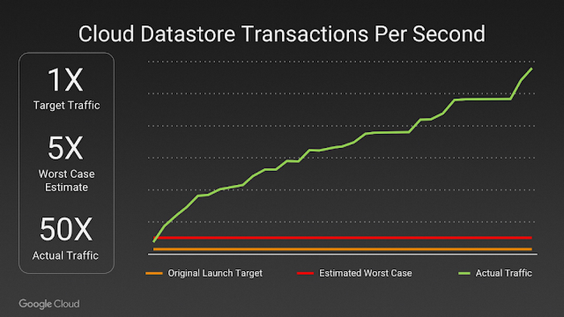

[source](https://cloud.google.com/blog/products/gcp/bringing-pokemon-go-to-life-on-google-cloud)

<!--v-->

#### Doctolib (2021)


[source](https://medium.com/doctolib/monday-july-12-at-doctolib-a-retrospective-9ac15c46ac19)

<!--v-->

#### Facebook October 2021 Failure

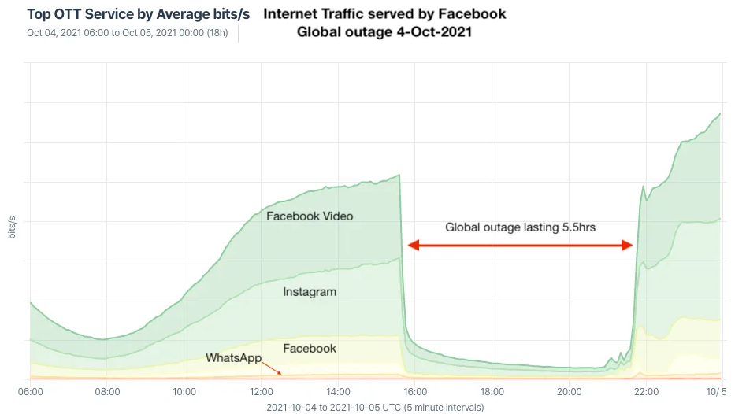

https://blog.cloudflare.com/october-2021-facebook-outage/

<!--v-->

#### AWS US-EAST-1 Failure (2022)

> 13 June 2023: AWS. The largest AWS region (us-east-1) degraded heavily for 3 hours, impacting 104 AWS services. A joke says that when us-east-1 sneezes the whole world feels it, and this was true: Fortnite matchmaking stopped working, McDonalds and Burger King food orders via apps couldn’t be made, and customers of services like Slack, Vercel, Zapier and many more all felt the impact. (incident details). We did a deepdive into this incident earlier in AWS’s us-east-1 outage.

https://aws.amazon.com/message/12721/

<!--v-->

#### Links

<http://highscalability.com>

<http://highscalability.com/all-time-favorites>

[Netflix: What happens when you press play - 2017](http://highscalability.com/blog/2017/12/11/netflix-what-happens-when-you-press-play.html)

[Mind boggling statistics on Amazon Prime Day](https://aws.amazon.com/blogs/aws/amazon-prime-day-2019-powered-by-aws/)

[Scaling ChatGPT](https://newsletter.pragmaticengineer.com/p/scaling-chatgpt)

<!--s-->

## Cloud Computing & AI

<!--v-->

### All about that scale

This was in 2022,

[BLOOM: A 176B-Parameter Open-Access Multilingual Language Model](https://arxiv.org/pdf/2211.05100)

> Training BLOOM took about 3.5 months to complete and consumed 1,082,990 compute hours. Training was conducted on 48 nodes, each having 8 NVIDIA A100 80GB GPUs (a total of 384 GPUs);

<!--v-->

### All about that scale

This was 2024,

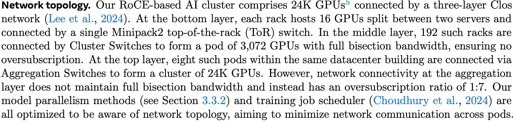

https://dblalock.substack.com/p/2024-8-4-arxiv-roundup-llama-31-training

<!--v-->

### AI Distributed Computing

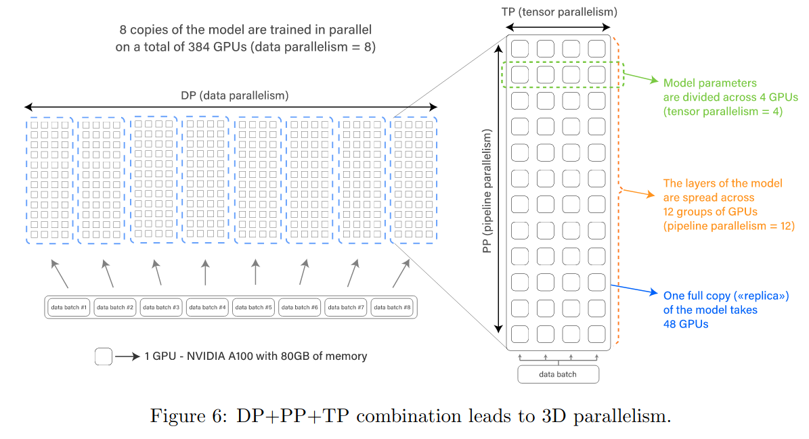

<!--v-->

### Stable Diffusion

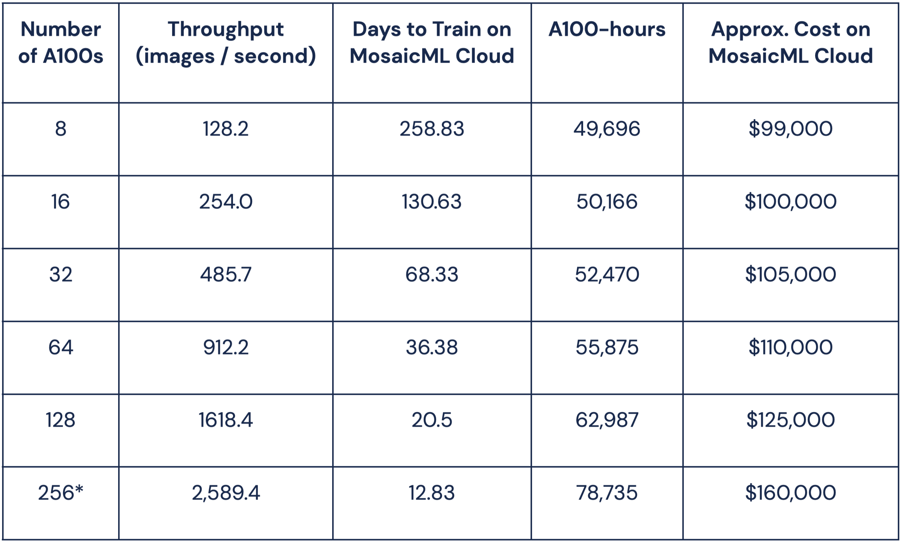 <!-- .element: height="60%" width="60%" -->

[Stable Diffusion Training Times](https://www.databricks.com/blog/stable-diffusion-2)

<!--v--> 

### AI Cloud Providers

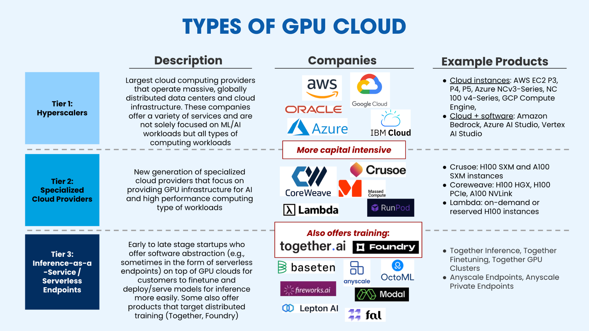  <!-- .element: height="50%" width="50%" -->

<!--v-->

## Very quick intro to MLOps

- https://huyenchip.com/machine-learning-systems-design/toc.html
- https://ml-ops.org/content/references.html


<!--v-->

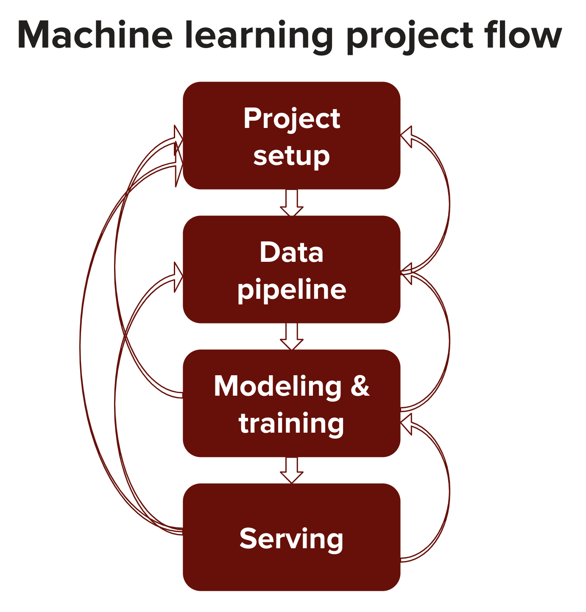 <!-- .element: height="40%" width="40%" -->

<!--v-->

MLOps Lifecycle

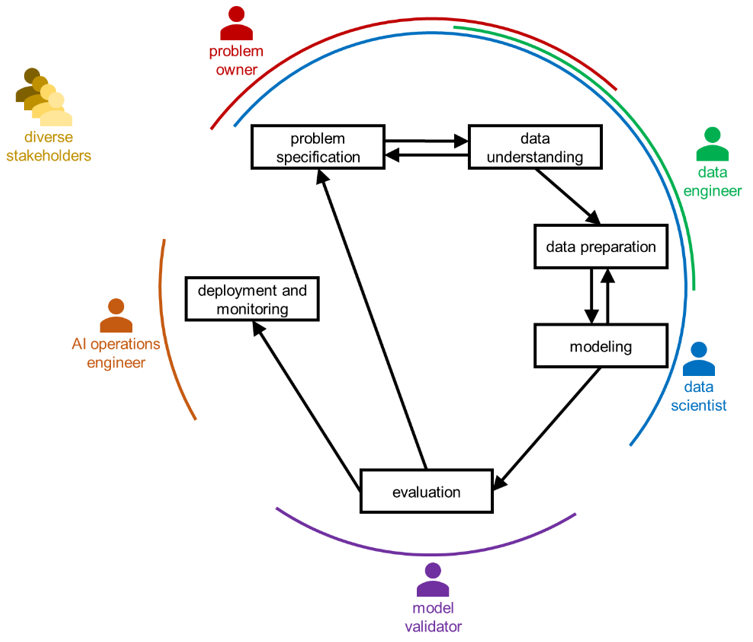  <!-- .element: height="50%" width="50%" -->

<!--v-->

MLOps Loop

 <!-- .element: height="50%" width="50%" -->

<!--v-->

Deployment architecture

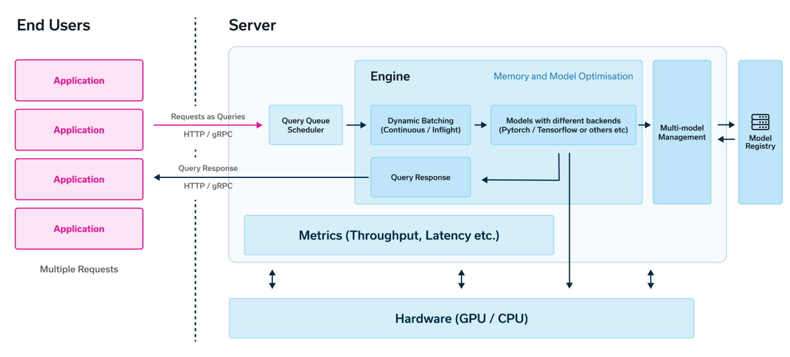 <!-- .element: height="50%" width="50%" -->

<!--v-->

### Layers of "enabling technology"

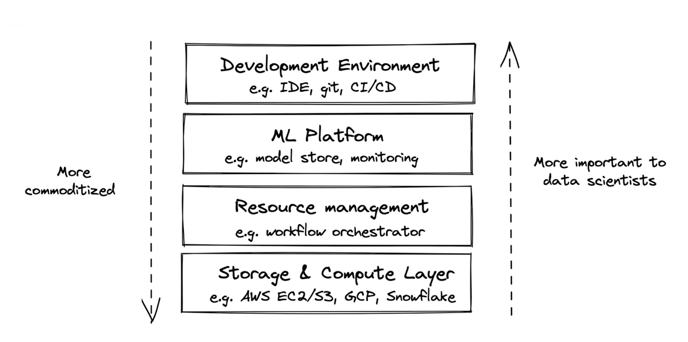 <!-- .element: height="75%" width="75%" -->

<!--v-->

### A full workflow 

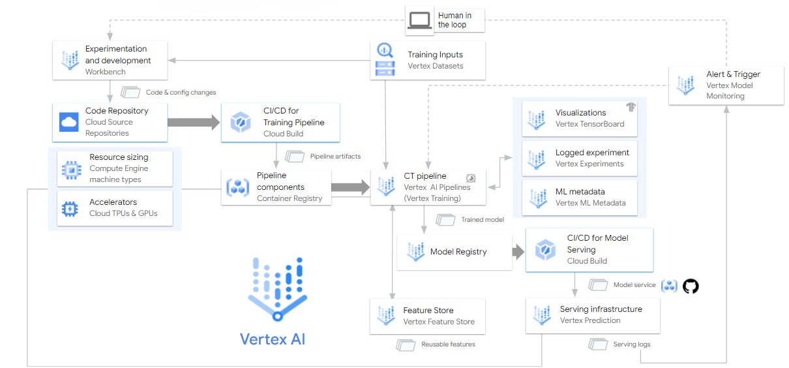

<!--v-->

### The need for tech to orchestrate ML workflows

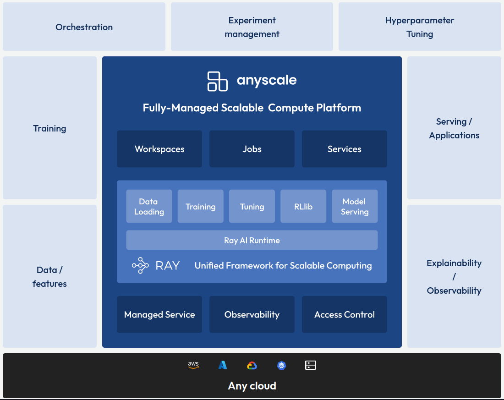  <!-- .element: height="50%" width="50%" -->

(And dask !)

<!--s-->

## What about me ?

What does it mean for YOU ?


<!--v-->

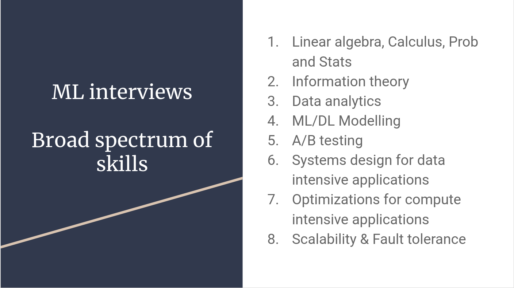

<!--v-->

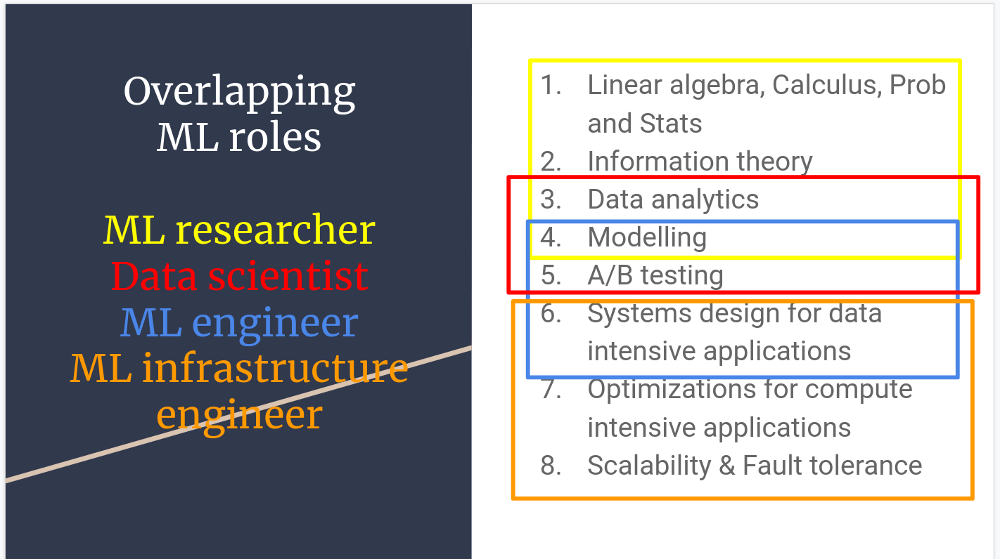

<!--v-->

#### Your mileage may vary

depending on:

- Your company
- Your role

but you will "deal with" cloud computing one way or another !

<!--v-->

### Personal Experience

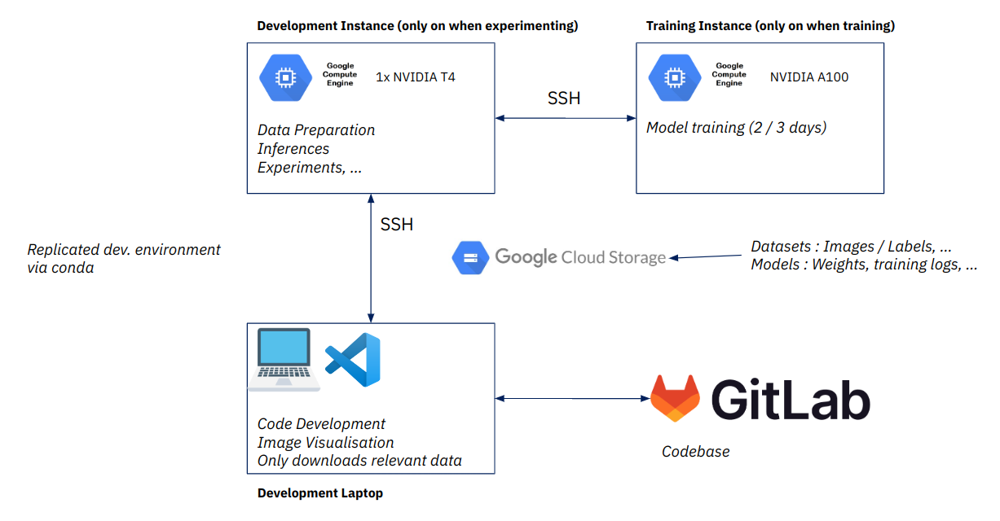
