# Intro to the hands-on

- A public cloud platform: Google Cloud Platform
- A remote development environment : GitHub Codespaces

<!--s-->

### Remote Development

<!--v-->

### Why "remote development" ?

AI / Data Science = Data + Compute + Software

- Your job consist in handling huge volume of data
- Your job requires high computational resources
- You're working as a team with centralized computing platform
- You're working remotely

<!--v-->

### Key use case

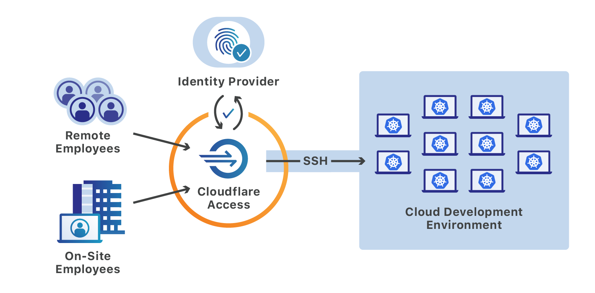 <!-- .element: height="50%" width="50%" -->

<!--v-->

### Key use case

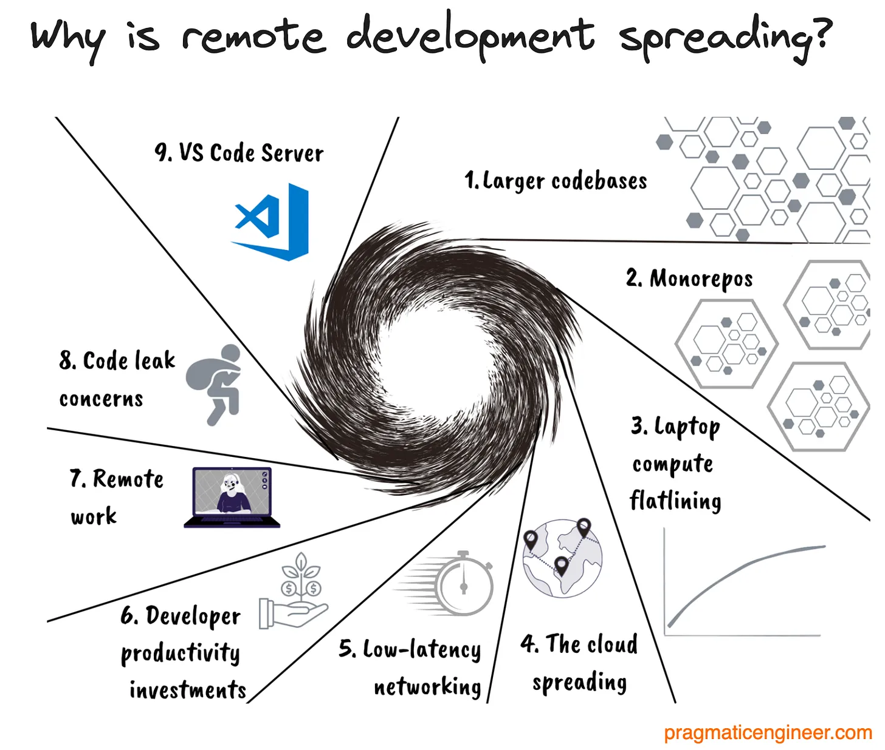 <!-- .element: height="40%" width="40%" -->

https://newsletter.pragmaticengineer.com/p/cloud-development-environments-why-now

<!--v-->

#### Your future daily routine

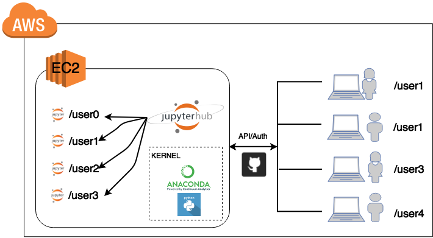  <!-- .element: height="40%" width="40%" -->

Another example (more managed) [Google Colab](https://colab.research.google.com/)

<!--v-->

#### Your future daily routine

An AI-centric example, https://lightning.ai/studios

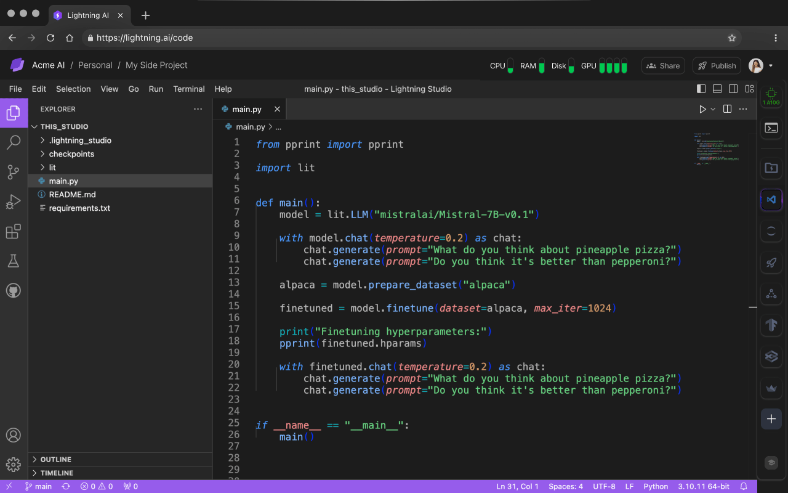  <!-- .element: height="40%" width="40%" -->

<!--v-->

#### Your future daily routine

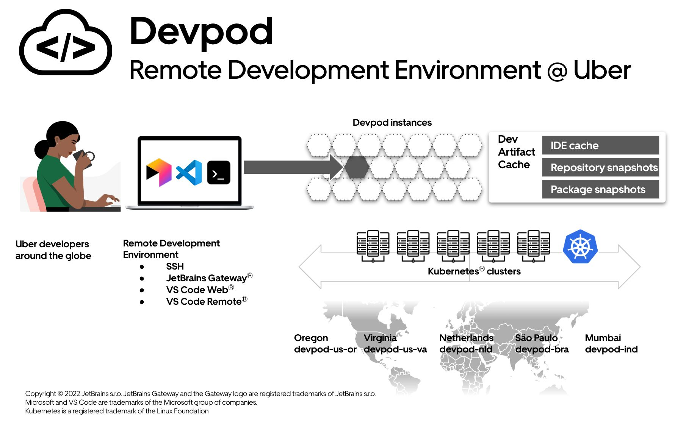  <!-- .element: height="40%" width="40%" -->

[Uber Blog describing their way of working](https://www.uber.com/en-FR/blog/devpod-improving-developer-productivity-at-uber/)

<!--v-->

### Problematics

- How to transfer code ?
- How to interact with the machines ?
- How to get access to the data ?

<!--v-->

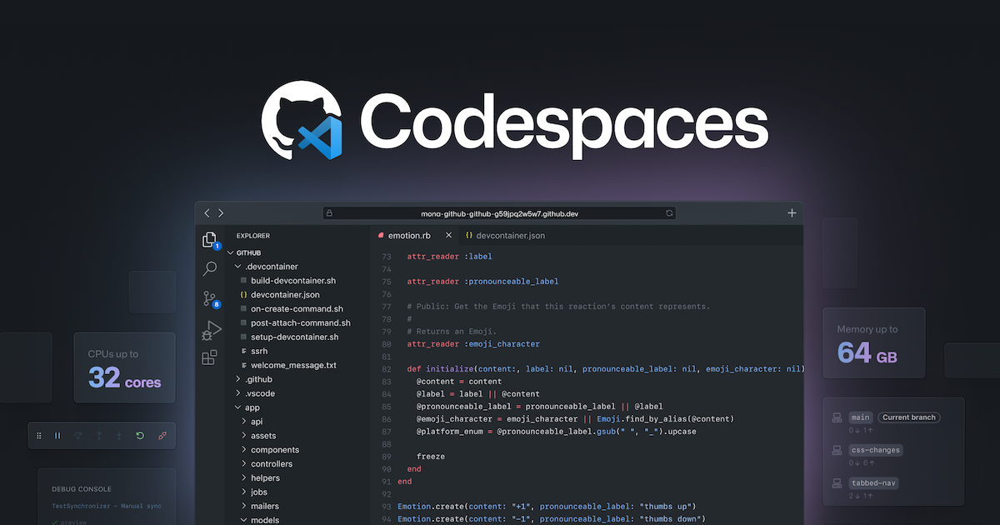 <!-- .element: height="50%" width="50%" -->

<!--v-->

#### [Github Codespaces](https://docs.github.com/en/codespaces/overview)

* [Github Codespaces](https://docs.github.com/en/codespaces) : A managed development environment by Microsoft Azure
* A virtual machine and a [containerized development environment](https://docs.github.com/en/codespaces/setting-up-your-project-for-codespaces/adding-a-dev-container-configuration/introduction-to-dev-containers)
* A lot of built-in bonuses including "in-browser" connection & TCP port forwarding with reverse proxy

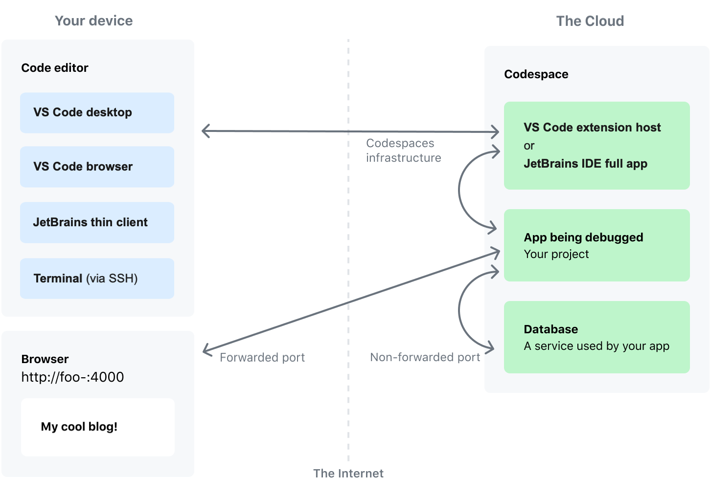  <!-- .element: height="40%" width="40%" -->

<!--s-->

# Google Cloud Platform

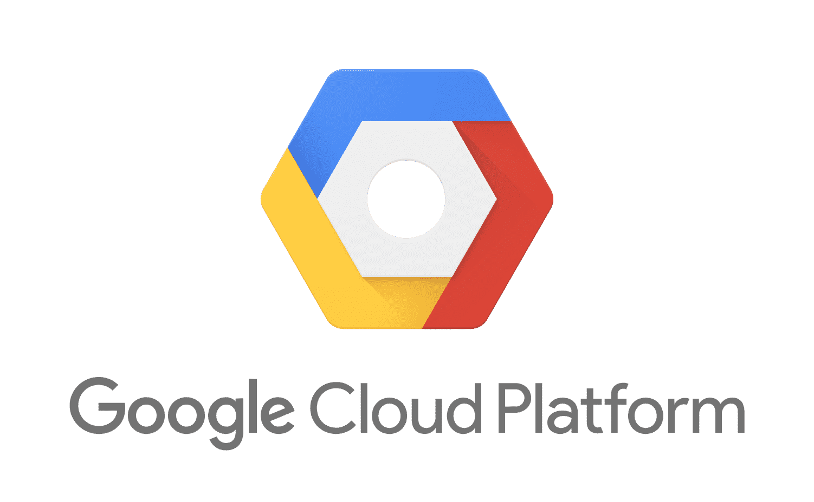  <!-- .element: height="40%" width="40%" -->

<!--v-->

- One of the main cloud provider
- Behind AWS in SaaS (serverless...)
- More "readable" product line (for a Cloud Provider...)
- Very good "virtual machine" management  
  * per second billing
  * fine-grained resource allocation

<!--v-->

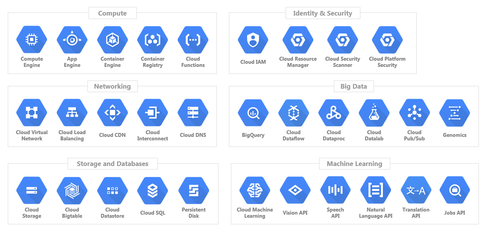  <!-- .element: height="40%" width="40%" -->

<!--v-->

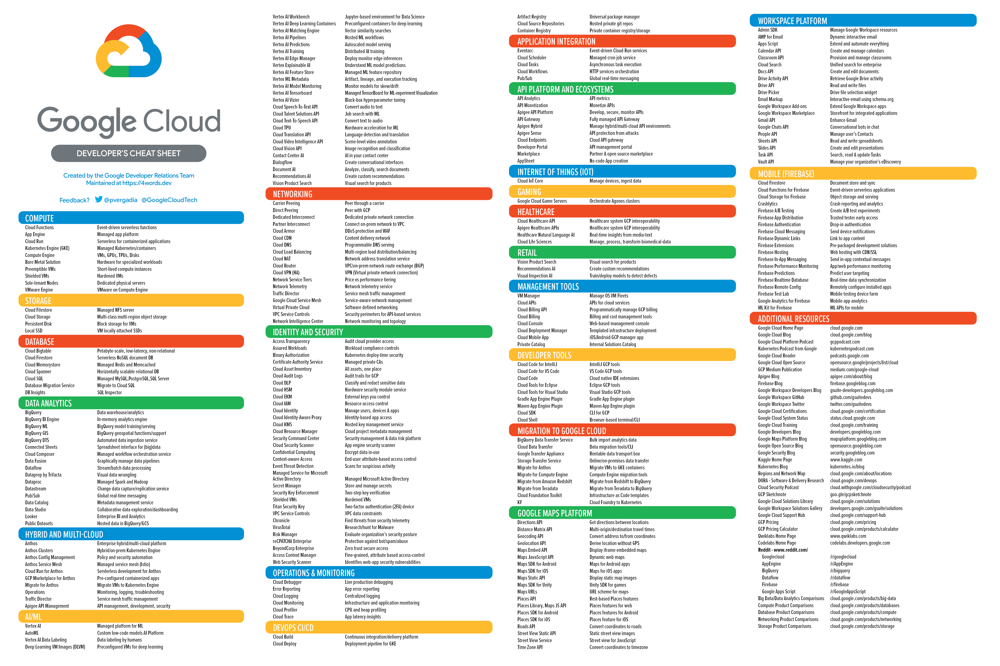

[GCP Services in 4 words or less](https://googlecloudcheatsheet.withgoogle.com/)

<!--v-->

### Concepts

<!--v-->

#### Zones and Regions

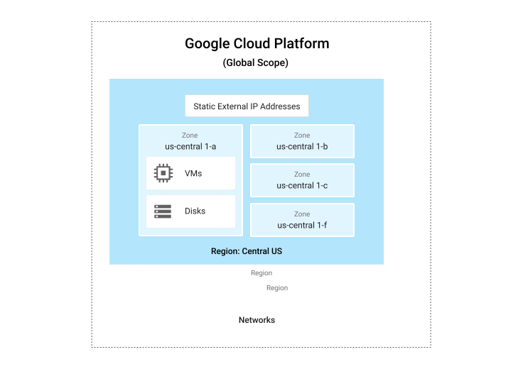

<!--v-->

#### Projects

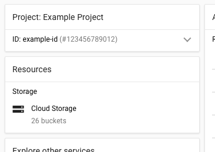

- Access (Enabling API/Services)
- Ressources (Quota by project)
- Networking
- Billing

<!--v-->

#### Concepts: Identity and Access Management (IAM)


<!--v-->

#### Main Products we are going to be looking at

- Google Compute Engine (virtual machine solutions)
- Google Cloud Storage (storage solutions)

<!--v-->

#### Google Compute Engine (GCE)

- The VM solution for GCP
- Images: Boot disks for VM instances
    example:  `ubuntu-1804`
- Machine Types: Ressources available to your instance
    example: `n1-standard-8` (8 vCPU, 30 Gb RAM)
- Storage Options: "Attached disk" that can persist once the instance is destroyed... can be HDD, SDD...
- Preemptible: "Spot instances" on AWS", cheap but can be killed any minute by GCP

<!--v-->

#### Google Cloud Storage (GCS)

- Cheaper storage than persistent disks
- Can be shared between multiple instances / zones
- Higher latency than local disk
- Data is stored in "buckets" **whose name are globally unique**

<!--v-->

#### GCS Storage Classes

| Class | Use Case | Price |
|-------|----------|-------|
| Standard | Frequent access | ~$0.02/GB |
| Nearline | Monthly access | ~$0.01/GB |
| Coldline | Quarterly access | ~$0.004/GB |
| Archive | Yearly access | ~$0.0012/GB |

Choose based on access frequency!

<!--v-->

#### GCS with gsutil CLI

```bash
# List buckets
gsutil ls

# Create bucket (name must be globally unique!)
gsutil mb gs://my-unique-bucket-name

# Upload file
gsutil cp local_file.csv gs://bucket/path/

# Download file
gsutil cp gs://bucket/path/file.csv ./

# Recursive copy (for folders)
gsutil -m cp -r gs://bucket/data/ ./local_data/
```

<!--v-->

#### GCS Access from VMs

VMs need **access scopes** to use GCS:

```bash
# When creating VM, add storage scope
gcloud compute instances create my-vm \
    --scopes=storage-rw  # read-write access to GCS
```

Or use a service account with appropriate IAM roles

<!--v-->

#### Interacting with GCP: The Console

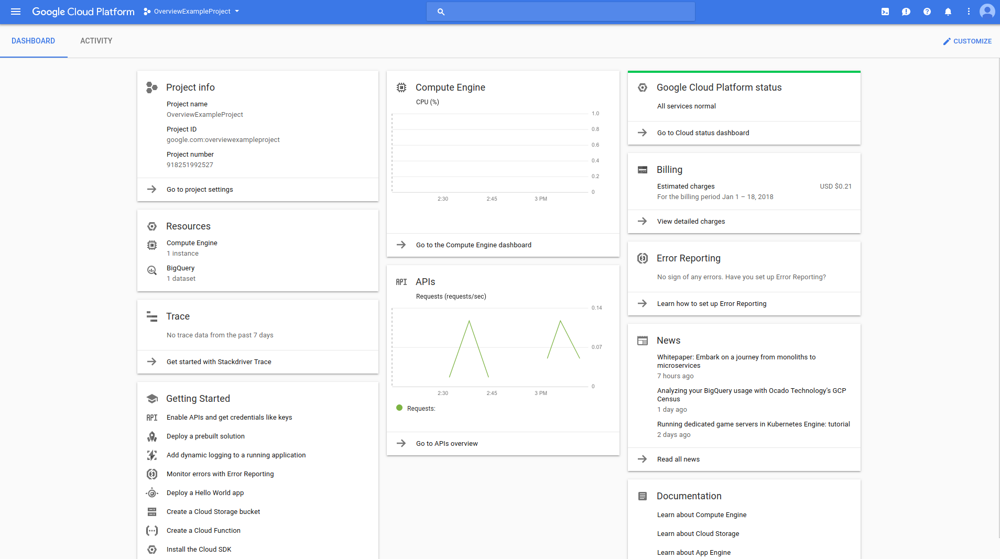

<https://console.cloud.google.com>

<!--v-->

#### Interacting with GCP: SDK & Cloud Shell

- Using the gcloud CLI: https://cloud.google.com/sdk/install
- Using Google Cloud Shell: A small VM instance you can connect to with your browser (that we won't use)

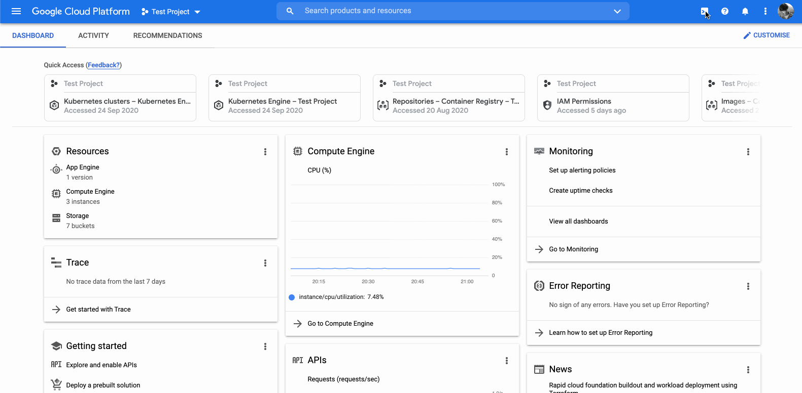

<!--s-->

### Self-paced hands-on


<!--v-->

#### Objectives

- ✅ Discover GitHub Codespace
- ✅ Create your GCP account, configure your credentials
- Create your first VMs and connect to it via SSH
    - Learn to use Tmux for detachable SSH sessions
- Interact with Google Cloud Storage
- End to End example : 
    - Write code in your codespace
    - Transfer it to your GCE instance
    - Run the code, it produces a model
    - Transfer the model weights to google cloud storage
    - Get it back from your codespace
- Bonus content
    - Managed SQL
    - Infrastructure as code

<!--v-->

#### SSH Tunnel, Port Forwarding

> In computer networking, **a port is a communication endpoint**. At the software level, within an operating system, a port is a logical construct that identifies a specific process or a type of network service. **A port is identified for each transport protocol and address combination** by a 16-bit unsigned number, known as the port number. The most common transport protocols that use port numbers are the Transmission Control Protocol (TCP) and the User Datagram Protocol (UDP).

[Wikipedia](https://en.wikipedia.org/wiki/Port_(computer_networking))

<!--v-->

#### Examples of protocols & usual ports

Examples

* SSH on port 22
* HTTP on port 80
* HTTPS on port 443

http apps can serve content over specific ports

Example

* Jupyter default is 8888 (that's why you open http://localhost:8888)

<!--v-->

#### SSH Tunnels

We usually connect to web app using `http://{ip}:{port}`

😨 but what if the machine is not available from the public internet / local network ?

➡️ Enter SSH with port forwarding

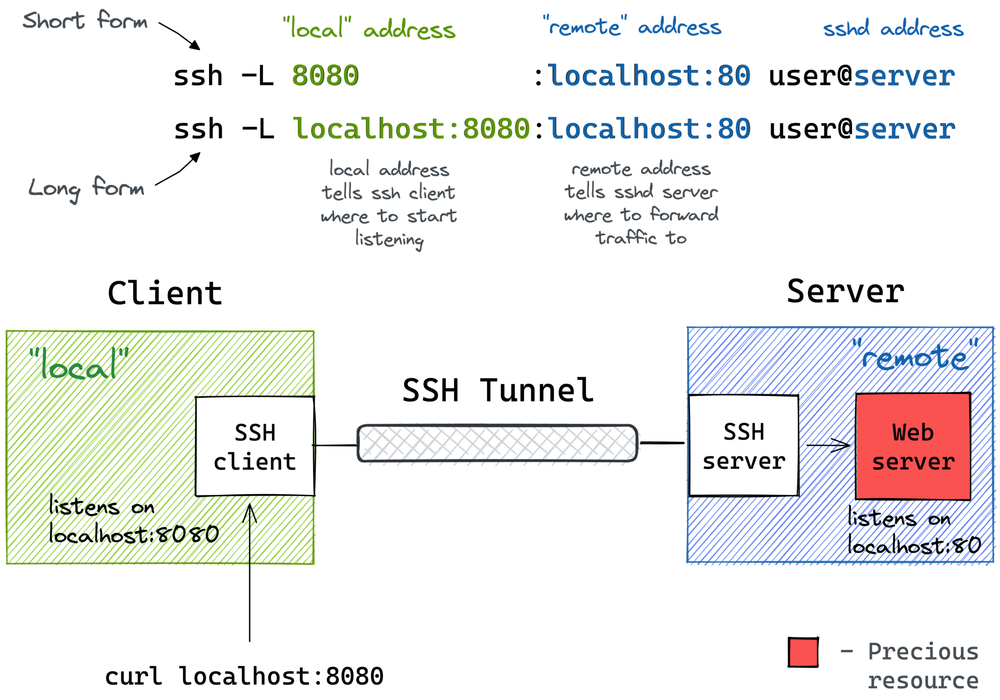  <!-- .element: height="50%" width="50%" -->

[Visual guide](https://iximiuz.com/en/posts/ssh-tunnels/)

<!--v-->

#### Tunnels of tunnels

* Some of you did Local Machine -> (browser) -> Codespace -> (ssh) -> VM -> Jupyterlab on port 8888
* With port transfers !
* What happens when you go to `http://(url-generated-by-codespaces):8888` in this case ?

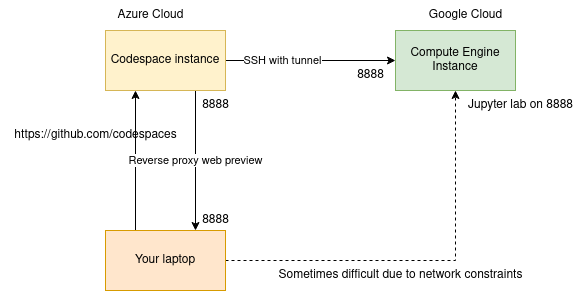
