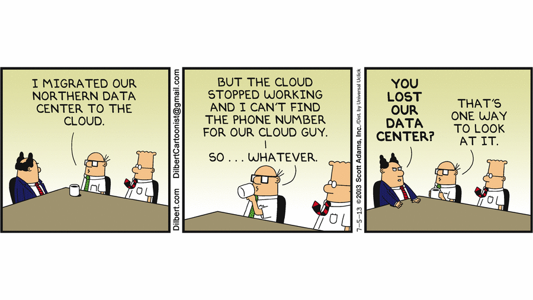
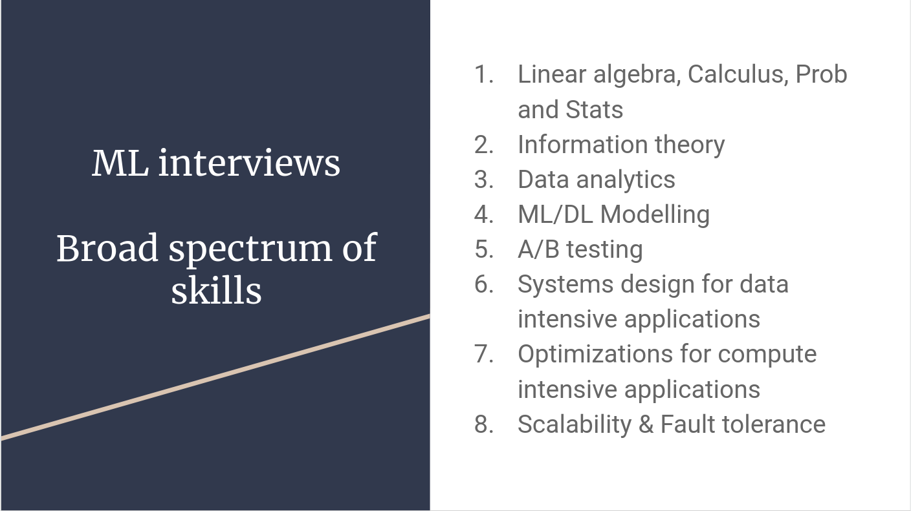
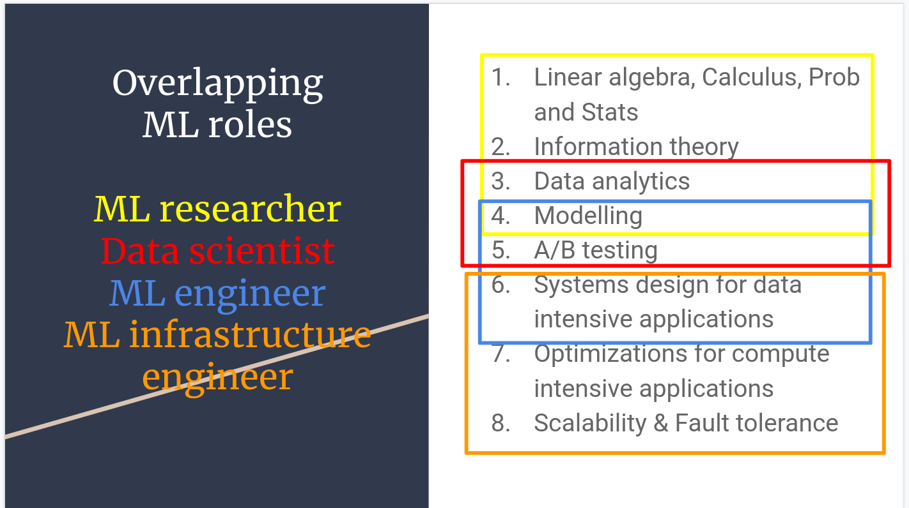

## "Using" the Cloud



<!--v-->

### Cloud Computing: A technical *evolution*

- More Virtualization
- More API
- More Managed Services

<!--s-->

### Cloud Computing: A usage **revolution**

<!--v-->

#### Empowerement / access to computing power

- Outsourcing infra, maintenance, security, development of new services
- Pay-per-use with "Infinitely scalable" infrastructure
- "No need to plan out" infrastructure
  - Enabling innovation
  - Power in the hands of developpers/builders

<!--v-->

#### Changing the way we interact with hardware

We interact with cloud providers using APIs...

```bash
gcloud compute --project=deeplearningsps instances create ${INSTANCE_NAME} \
    --zone=${ZONE} \
    --machine-type=n1-standard-8 \
    --scopes=default,storage-rw,compute-rw \
    --maintenance-policy=TERMINATE \
    --image-family=ubuntu-1804-lts \
    --image-project=ubuntu-os-cloud \
    --boot-disk-size=200GB \
    --boot-disk-type=pd-standard \
    --accelerator=type=nvidia-tesla-p100,count=1 \
    --metadata-from-file startup-script=startup_script.sh
```

<!--v-->

#### Before...


<!--v-->

#### After...

```yaml
resources:
- name: vm-created-by-deployment-manager
  type: compute.v1.instance
  properties:
    zone: us-central1-a
    machineType: zones/us-central1-a/machineTypes/n1-standard-1
    disks:
    - deviceName: boot
      type: PERSISTENT
      boot: true
      autoDelete: true
      initializeParams:
        sourceImage: projects/debian-cloud/global/images/family/debian-9
    networkInterfaces:
    - network: global/networks/default
```

<!--v-->

#### Infrastructure as Code

- Infra is now managed via text files
- Data is securely stored on storage
- So we store code + urls on git... and everything is reproducible !
- We use automated deployment tools (terraform, gcp deployment manager...)

<!--v-->

#### Pet vs Cattle


<!--v-->

#### Fully virtual development environment


<!--s-->

### Let's discuss

<!--v-->

**Is using cloud computing less expensive ?**

- 👍 Depend on your {normal / peak} utilization
- 👍 Access to latest hardware without investment
- 👎 Fully utilized hardware is more expensive on the cloud
- 👎 CLOUD HYGIENE !
  - Watch for unused services / storage
  - Shutdown machines when not used
  - Services stack up...

<!-- .element: class="fragment" -->

<!--v-->

**Is using cloud computing more secure / safer ?**

- 👍 The best engineers in the world working on it
- 👍 Secure regions / private cloud...
- 👎 Your data somewhere in some datacenter...
- 👎 "Dependency" towards your cloud provider...

<!-- .element: class="fragment" -->

<!--s-->

### Cloud usage, some anecdotes

<!--v-->

#### Big Tech public cloud bills

- Apple in 2019 [350m$ on AWS / year](https://www.theverge.com/2019/4/22/18511148/apple-icloud-cloud-services-amazon-aws-30-million-per-month)
- Spotify in 2018 [150m$ on GCP / year](https://www.cnbc.com/2018/03/20/spotify-will-spend-nearly-450-million-on-google-cloud-over-3-years.html)
- Lyft in 2019 [100m$ on AWS / year](https://www.cnbc.com/2019/03/01/lyft-plans-to-spend-300-million-on-aws-through-2021.html)

<!--v-->

#### Pokemon Go Launch (2016)


[source](https://cloud.google.com/blog/products/gcp/bringing-pokemon-go-to-life-on-google-cloud)

<!--v-->

#### Doctolib (2021)


[source](https://medium.com/doctolib/monday-july-12-at-doctolib-a-retrospective-9ac15c46ac19)

<!--v-->

#### Facebook (2021)

How everything can go wrong...


https://blog.cloudflare.com/october-2021-facebook-outage/

<!--v-->

#### Links

<http://highscalability.com>

<http://highscalability.com/all-time-favorites>

[Netflix: What happens when you press play - 2017](http://highscalability.com/blog/2017/12/11/netflix-what-happens-when-you-press-play.html)

[Mind boggling statistics on Amazon Prime Day](https://aws.amazon.com/blogs/aws/amazon-prime-day-2019-powered-by-aws/)

<!--s-->

### What does it mean for YOU ?


<!--v-->



<!--v-->



<!--v-->

#### Your mileage may vary

depending on:

- Your company
- Your role

but you will "deal with" cloud computing one way or another !

<!--v-->

#### Personal experience

- What do I use ?
- Why do I use it ?
- How do I do ?
