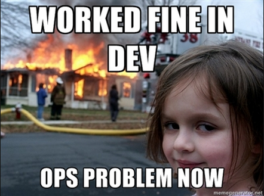
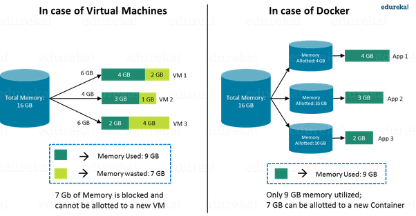
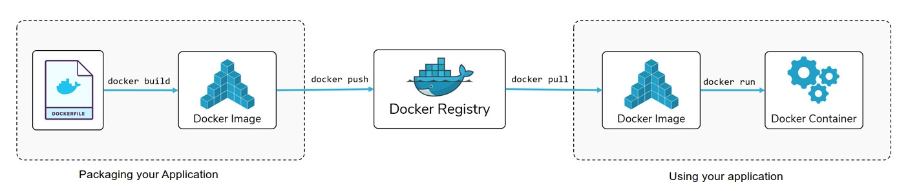

## From Virtualisation to Containerisation



<!--v-->

### Outline

* **Presentation** (30m)
* **Self-paced Workshop** (1h30)
* To be continued with Orchestration & Deployment (next Tuesday)

<!--v-->

#### This class will be successful if you understand

* why we need a tool like docker
* the basics of docker (containers, images) <!-- .element: class="fragment" data-fragment-index="1" -->
* the basics of a container registry <!-- .element: class="fragment" data-fragment-index="2" -->
* how to pull an image and run a container <!-- .element: class="fragment" data-fragment-index="3" -->
* what a Dockerfile looks like <!-- .element: class="fragment" data-fragment-index="4" -->

<!--s-->

### The need for Containers in software


<!--v-->

#### IT Multimodality


<!--v-->

#### The Matrix From Hell


<!--v-->

#### Analogy


<!--v-->

#### Solution ?


<!--v-->

#### Solution !


<!--v-->


<!--v-->

 <!-- .element: height="60%" width="60%" -->

<!--s-->


<!--v-->

Docker is **a** solution that **standardizes** packaging and execution of software in isolated
 environments
 (**containers**) that share resources and can communicate between themselves

> Build, Share, and Run Any App, Anywhere

<!--v-->

[Docker](https://www.docker.com/)

* Created in 2013
* Open Source
* Not a new idea but set a new standard
* Docker is a company built around its main product (Docker Engine)
* in charge of dev of everything docker + additional paid services (Docker hub...)

<!--v-->

Docker is not the only solution for containers

<https://chimeracoder.github.io/docker-without-docker/#30>

<https://podman.io/>

<!--v-->

Docker is some fancy tech over linux kernel capabilities (containers)


[more info](https://medium.com/@goyalsaurabh66/docker-basics-cb006b9be243)

<!--v-->

But Docker is available on [Windows and MacOS](https://www.docker.com/products/docker-desktop) !

 <!-- .element: height="50%" width="50%" -->

<!--v-->

  <!-- .element: height="40%" width="40%" -->

https://www.youtube.com/c/AurelieVache/videos

<!--s-->

### Containers or Virtual Machines

<!--v-->

#### Similarities

* Isolated environments for applications
* Movable between hosts

<!--v-->

#### Drawbacks of VMs

* VM Contains full OS at each install => Install + Resource overhead
* VM needs pre-allocation of resource for each VM (=> Waste if not used)
* Communication between VM <=> Communication between computers

<!--v-->

#### Container vs Virtual Machine


<!--v-->

#### Why are docker containers lightweight ?


<!--v-->

#### Container vs Virtual Machine, an Analogy


<!--v-->

#### Resources allocation in containers

* Containers share underlying OS / Kernels
* The container engine can allocate resources (CPU, Storage, RAM) on the fly (!= VM)
* GPU is way easier to manage / share with containers



<!--v-->

#### Some drawbacks of containers

* Containers are based on linux tech  
  (Docker makes Windows container possible though)
* Isolation is not perfect since containers share underlying kernels (security and stability)

<!--s-->

### Containers for Data Science

<!--v-->

#### Multiple People


<!--v-->

#### Complex Workflows

 <!-- .element: height="40%" width="40%" -->

<!--v-->

#### Data Science is about reproducibility

* Experimental science
* Communicating results
* Hands-out to other teams
* Deployment and versioning of models

<!--v-->

#### So... containers ?

* ... for deployment
* ... for standardized development environments
* ... dependency management
* ... for complex / large scale workflows

~it works on my notebook !~ *here's the model ready to run !*

<!--v-->

[Netflix and notebook scheduling](https://medium.com/netflix-techblog/scheduling-notebooks-348e6c14cfd6)


<!--v-->

https://www.kubeflow.org/

 <!-- .element: height="55%" width="55%" -->

<!--s-->

### Using Docker in practice



<!--v-->

#### Vocabulary of Docker

* **Layer**: Set of read-only files to provision the system
* **Image**: Read-Only layer "snapshot" (or blueprint) of an environment. Can inherit from another **Image**. Image have a *name* and a *tag*
* **Container**: Read-Write instance of an **Image**
* **DockerFile**: Description of the process used to build an Image
* **Container Registry**: Repository of Docker Images
* **Dockerhub**: The main container registry of docker.com

<!--v-->

#### Workflow

 <!-- .element: height="55%" width="55%" -->

<!--v-->

#### Layers, Container, Image

 <!-- .element: height="45%" width="45%" -->

<!--v-->

#### Layer / Image Analogy

Docker:
```Dockerfile
FROM python:3.6
RUN pip install torch
CMD ipython
```

```bash
docker build -f Dockerfile -t my-image:1.0 .
docker run my-image
```

Python:
```python
class BaseImage:
    def __init__(self, a):
       self.a = a

class NewImage(BaseImage):
    def __init__(self, a, b):
       super(NewImage, self).__init__(a=a)
       self.b = b

container = NewImage(a=0,b=1)
```

<!--v-->

#### Dockerfile

* Used to build Images

```Dockerfile
FROM python:3.7
ENV MYVAR="HELLO"
RUN pip install torch
COPY my-conf.txt /app/my-conf.txt
ADD my-file.txt /app/my-file.txt
EXPOSE 9000
WORKDIR "/WORKDIR"
USER MYUSER
ENTRYPOINT ["/BIN/BASH"]
CMD ["ECHO” , "${MYVAR}"]
```

```bash
docker build -f Dockerfile -t my-image:1.0 .
docker run my-image
```

* Reproducible (if you include static data)
* Can be put under version control (simple text file)

<!--v-->

#### Architecture


<!--v-->

#### Registry

* Local registry: All images/containers in your machine
* https://hub.docker.com/
* GCP Container Registry
* Social Dimension (share docker images to speed up development/deployment)

<!--v-->

#### In practice


<!--v-->

### What about multi-applications containers ?

<!--v-->

#### Docker Compose

* Multi-containers application with networking (communication)
* "Glue" for complex applications and microservices


<!--v-->

#### Docker Compose (example)

A database and a webapp

```yaml
version: '3'

services:
  app:
    build: .
    image: takacsmark/flask-redis:1.0
    environment:
      - FLASK_ENV=development
    ports:
      - 5000:5000

  redis:
    image: redis:4.0.11-alpine
```

`docker-compose up` starts both images (you will see that next week)

<!--v-->

#### REMEMBER THIS !!!


<!--s-->

### Docker and GCP

<!--v-->

#### GCP & Docker

* The per-project dockerhub is called [Container Registry](https://cloud.google.com/container-registry/) 
* Your images look like this `eu.gcr.io/project-id/a/b/c:1.0`
* You can use [Google Cloud Build](https://cloud.google.com/cloud-build/) to build dockerfiles remotely 
* `gcloud builds submit --tag gcr.io/[PROJECT_ID]/quickstart-image .`
* To use gcloud with docker: `gcloud auth configure-docker`
* You can even deploy ["virtual machines" with containers directly](https://cloud.google.com/compute/docs/containers)

<!--s-->

### Demo time

<!--v-->

#### bonus : play-with-docker

* You need to have a docker hub account : https://hub.docker.com/
* https://labs.play-with-docker.com/
* Free, interactive, cluster of vms to experiment docker with
* https://training.play-with-docker.com/ lots of resoures !

<!--v-->


<!--s-->

### Cheatsheets

<!--v-->


<!--v-->

#### Dockerfile : Description d'une image

```Dockerfile
FROM python:3.7
ENV MYVAR="HELLO"
RUN pip install torch
COPY my-conf.txt /app/my-conf.txt
ADD my-file.txt /app/my-file.txt
EXPOSE 9000
WORKDIR "/WORKDIR"
USER MYUSER
ENTRYPOINT ["/BIN/BASH"]
CMD ["ECHO” , "${MYVAR}"]
```

```bash
docker build -f Dockerfile -t my-image:1.0 .
docker run my-image
```

<!--v-->

#### Images

    "docker search" sur un registry
        public (DokerHub)
        privé (entreprise)
    "docker build" à partir d'un Dockerfile
    "docker commit" sur un conteneur modifié
    "docker import" d'une arbo de base :
    
    cat centos6-base.tar | docker import - centos6-base

<!--v-->

#### Docker CLI

    docker create   : crée un conteneur
    docker run      : crée et démarre un conteneur
    docker stop     : arrête un conteneur
    docker start    : démarre un conteneur
    docker restart  : redémarre un conteneur
    docker rm       : supprime un conteneur
    docker kill     : envoie un SIGKILL au conteneur
    docker attach   : se connecte à un conteneur en exécution 
    docker exec     : exécute une cmd dans un conteneur

<!--v-->

#### Docker run

    -d, --detach       Run container in background and print ID
    -e, --env=[]       Set environment variables
    -i, --interactive  Keep STDIN open even if not attached
    -p, --publish=[]   Publish a container's port(s) to the host
    --rm        5_orchestration       Automatically rm container when it exits
    -t, --tty          Allocate a pseudo-TTY
    -v, --volume=[]    Bind mount a volume
    -w, --workdir      Working directory inside the container
