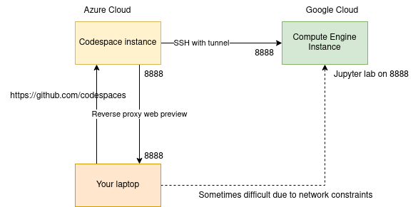

# Google Cloud Platform

<!--v-->

- One of the main cloud provider
- Behind AWS in SaaS (serverless...)
- More "readable" product line (for a Cloud Provider...)
- Very good "virtual machine" management  
  * per second billing
  * fine-grained resource allocation

<!--v-->

<!--v-->

<!--v-->

### Concepts

<!--v-->

#### Zones and Regions

<!--v-->

#### Projects

- Access (Enabling API/Services)
- Ressources (Quota by project)
- Networking
- Billing

<!--v-->

#### Concepts: Identity and Access Management (IAM)

<!--v-->

#### Main Products we are going to be looking at

- Google Compute Engine (virtual machine solutions)
- Google Cloud Storage (storage solutions)

<!--v-->

#### Google Compute Engine (GCE)

- The VM solution for GCP
- Images: Boot disks for VM instances
    example:  `ubuntu-1804`
- Machine Types: Ressources available to your instance
    example: `n1-standard-8` (8 vCPU, 30 Gb RAM)
- Storage Options: "Attached disk" that can persist once the instance is destroyed... can be HDD, SDD...
- Preemptible: "Spot instances" on AWS", cheap but can be killed any minute by GCP

<!--v-->

#### Google Cloud Storage (GCS)

- Cheaper storage than persistent disks
- Can be shared between multiple instances / zones
- Higher latency
- Several types of storage (w/ different r/w costs & performance)
- Data is stored in "buckets" **whose name are globally unique**

<!--v-->

#### Interacting with GCP: The Console

<https://console.cloud.google.com>

<!--v-->

#### Interacting with GCP: SDK & Cloud Shell

- Using the gcloud CLI: https://cloud.google.com/sdk/install
- Using Google Cloud Shell: A small VM instance you can connect to with your browser (that we won't use)

<!--s-->

### Self-paced hands-on

<!--v-->

#### Objectives

- Create your GCP account, configure your credentials
- Connect to github Codespace
- Creating your first VMs and connect to it via SSH
- Interaction with Google Cloud Storage

<!--v-->

#### SSH Tunnel, Port Forwarding

> In computer networking, **a port is a communication endpoint**. At the software level, within an operating system, a port is a logical construct that identifies a specific process or a type of network service. **A port is identified for each transport protocol and address combination** by a 16-bit unsigned number, known as the port number. The most common transport protocols that use port numbers are the Transmission Control Protocol (TCP) and the User Datagram Protocol (UDP).

[Wikipedia](https://en.wikipedia.org/wiki/Port_(computer_networking))

<!--v-->

#### Examples of protocols & usual ports

Examples

* SSH on port 22
* HTTP on port 80
* HTTPS on port 443

http apps can serve content over specific ports

Example

* Jupyter default is 8888 (that's why you open http://localhost:8888)

<!--v-->

#### SSH Tunnels

We usually connect to web app using `http://{ip}:{port}`

😨 but what if the machine is not available from the public internet / local network ?

➡️ Enter SSH with port forwarding

  <!-- .element: height="50%" width="50%" -->

[Visual guide](https://iximiuz.com/en/posts/ssh-tunnels/)

<!--v-->

#### Github Codespaces

https://docs.github.com/en/codespaces/overview

<!--v-->

#### Tunnels of tunnels

* Some of you did Local Machine -> (browser) -> Codespace -> (ssh) -> VM -> Jupyterlab on port 8888
* With port transfers !
* What happens when you go to `http://(url-generated-by-codespaces):8888` in this case ?

<!--v-->

#### Demo

- Google Compute Engine Interface
- Github Codespaces

