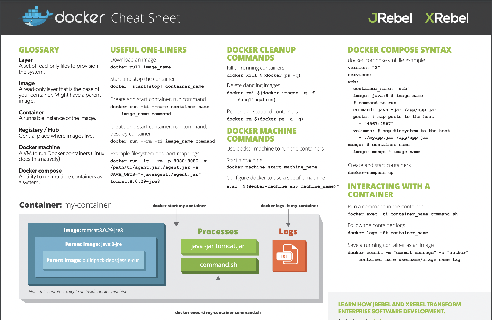
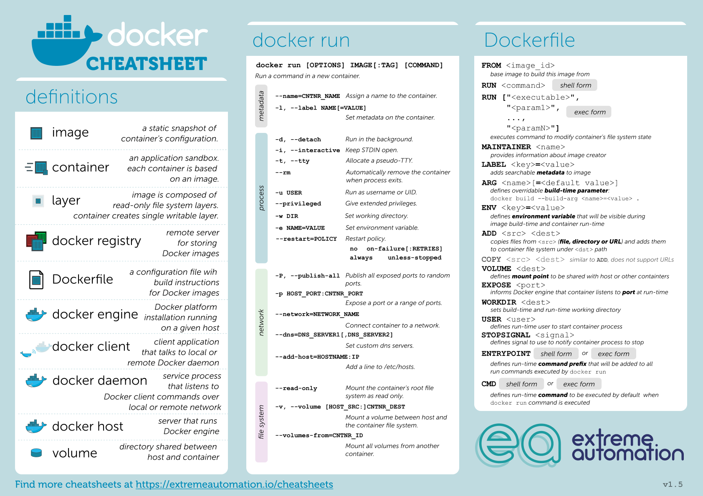

# Docker Cheat Sheet

<!--v-->

 <!-- .element: height="60%" width="60%" -->

<!--v-->

  <!-- .element: height="60%" width="60%" -->

<!--v-->

#### Dockerfile : Description d'une image

```Dockerfile
FROM python:3.7
ENV MYVAR="HELLO"
RUN pip install torch
COPY my-conf.txt /app/my-conf.txt
ADD my-file.txt /app/my-file.txt
EXPOSE 9000
WORKDIR "/WORKDIR"
USER MYUSER
ENTRYPOINT ["/BIN/BASH"]
CMD ["ECHO” , "${MYVAR}"]
```

```bash
docker build -f Dockerfile -t my-image:1.0 .
docker run my-image
```

<!--v-->

#### Images

```text
"docker search" sur un registry
    public (DokerHub)
    privé (entreprise)
"docker build" à partir d'un Dockerfile
"docker commit" sur un conteneur modifié
"docker import" d'une arbo de base :

cat centos6-base.tar | docker import - centos6-base
```

<!--v-->

#### Docker CLI

```text
    docker create   : crée un conteneur
    docker run      : crée et démarre un conteneur
    docker stop     : arrête un conteneur
    docker start    : démarre un conteneur
    docker restart  : redémarre un conteneur
    docker rm       : supprime un conteneur
    docker kill     : envoie un SIGKILL au conteneur
    docker attach   : se connecte à un conteneur en exécution 
    docker exec     : exécute une cmd dans un conteneur
```

<!--v-->

#### Docker run

```text
-d, --detach       Run container in background and print ID
-e, --env=[]       Set environment variables
-i, --interactive  Keep STDIN open even if not attached
-p, --publish=[]   Publish a container's port(s) to the host
--rm        5_orchestration       Automatically rm container when it exits
-t, --tty          Allocate a pseudo-TTY
-v, --volume=[]    Bind mount a volume
-w, --workdir      Working directory inside the container
```