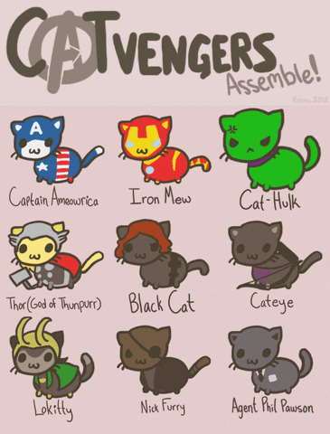
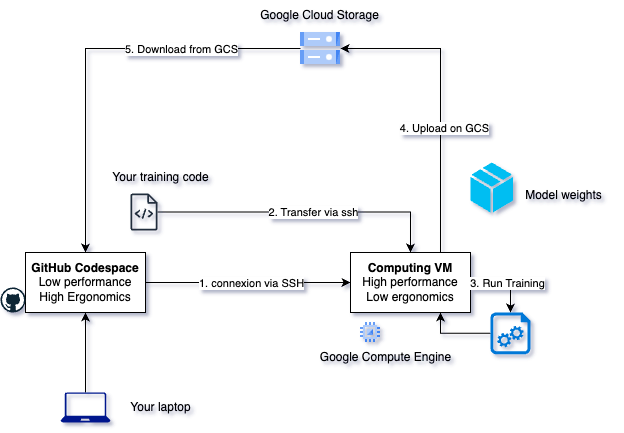
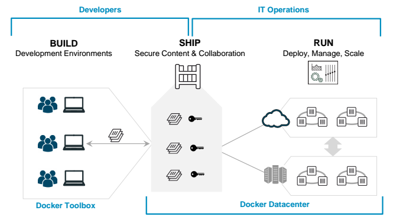

### BE: GCP & Docker

<!--v-->

#### Team, assemble

Get by groups of 2-5, cooperate, help each other out

<!--v-->

#### 3 parts "BE" to apply everything you have learned

- Train your model in a google compute engine instance and analyse results
- Practice the docker build-ship-run cycle with team mates
- Deploy a website to a cloud instance

<!--v-->

#### 1. Google Cloud Platform Workflow

<!--v-->

#### 2. Build Ship Run

 <!-- .element: height="40%" width="40%" -->

<!--v-->

#### 3. Deploy a website 

* Rediscover Streamlit
* Deploy a container straight to a new virtual machine

<!--v-->

[BE walkthrough](../1_4_be.html)
