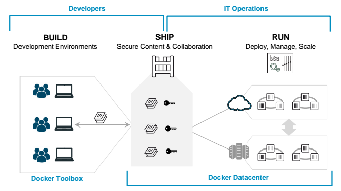

### BE: GCP & Docker

<!--v-->

#### We are going to

 <!-- .element: height="20%" width="20%" -->

using

  <!-- .element: height="20%" width="20%" -->

<!--v-->

#### Team, assemble

Get by groups of 4, cooperate, help each other out

<!--v-->

#### Today, you will (1/2)

* Connect to a **GCP project** (with multiple people)
* Create a **Google Compute Engine** instance
* Connect to it with **SSH**
* Build a **Docker Image** (using pre-made resources from **Google Cloud Storage**)
* Push it to a **Container Registry**
* Pull a teammate's **Image** from the same registry
* Run the **container** and the app inside it
* Use **port forwarding** to display the running app in your browser

<!--v-->

#### Today, you will (2/2)

* Rediscover Streamlit
* Deploy a container straight to a new virtual machine

<!--v-->

[BE walkthrough](../4_be.html)
