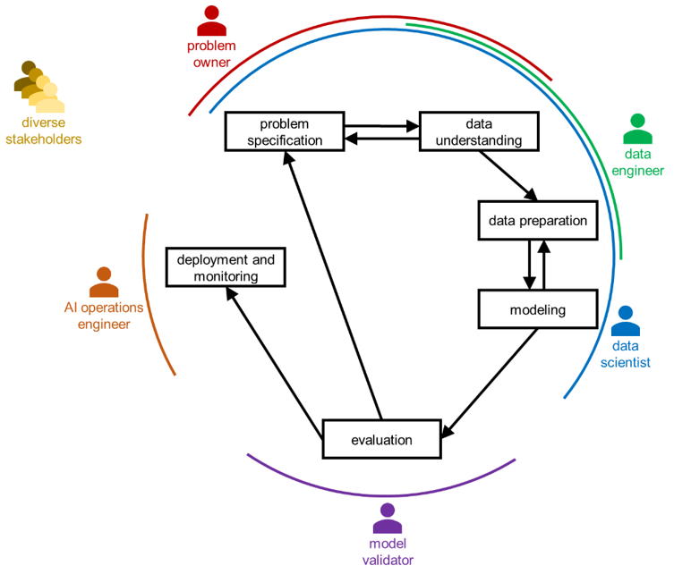
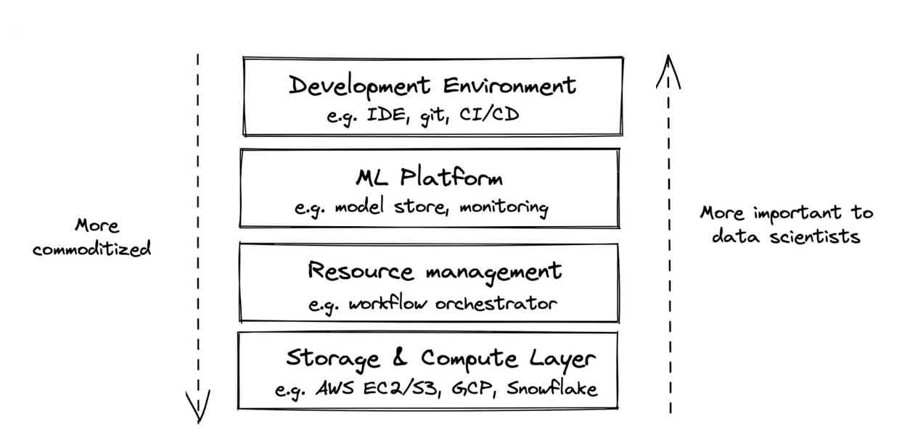
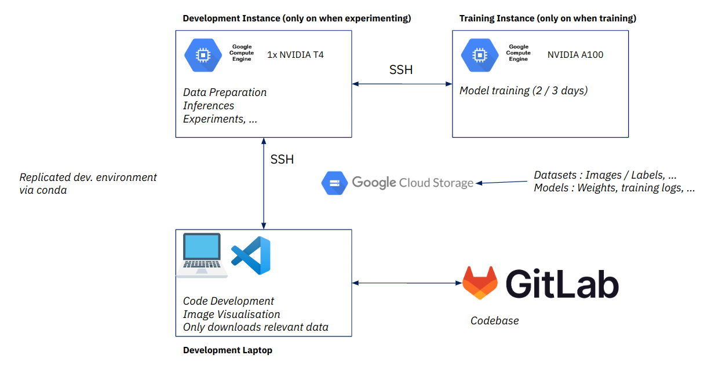
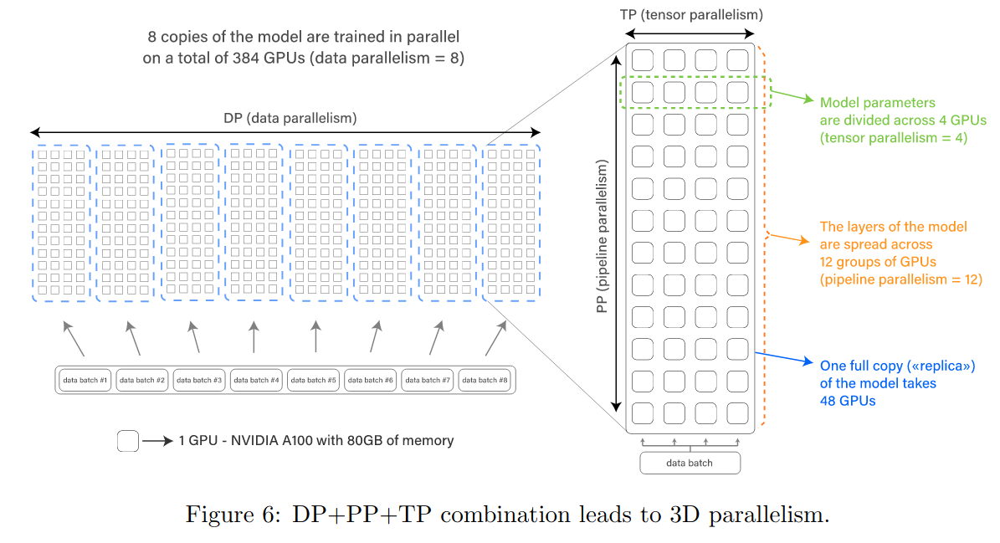
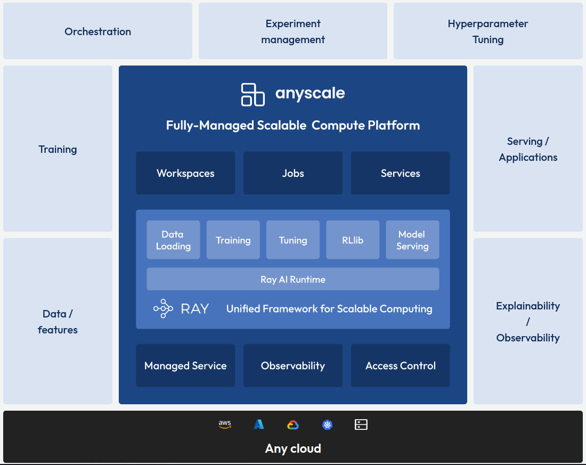
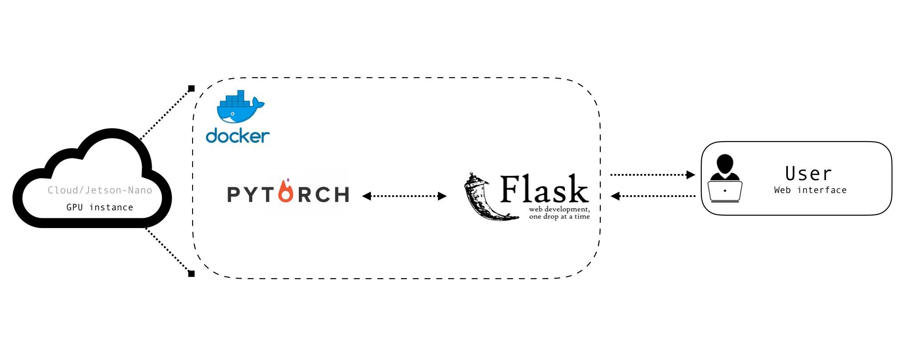

This class

- **Quick notions about MLOPS**
- **Cloud Computing & Docker applied to AI**
- **Hands on : Deploy your model in production**

<!--s-->

## Very quick intro to MLOps

<!--v-->

 <!-- .element: height="40%" width="40%" -->

<!--v-->

  <!-- .element: height="50%" width="50%" -->

<!--v-->

 <!-- .element: height="50%" width="50%" -->

<!--v-->

### Layers of "enabling technology"

 <!-- .element: height="75%" width="75%" -->

<!--v-->

- https://huyenchip.com/machine-learning-systems-design/toc.html
- https://ml-ops.org/content/references.html

<!--s-->

## Cloud Computing & AI

<!--v-->

### My usage : Flexibility



<!--v-->

### A full workflow 


<!--v-->

### All about that scale

[BLOOM: A 176B-Parameter Open-Access Multilingual Language Model](https://arxiv.org/pdf/2211.05100)

> Training BLOOM took about 3.5 months to complete and consumed 1,082,990 compute hours. Training was conducted on 48 nodes, each having 8 NVIDIA A100 80GB GPUs (a total of 384 GPUs);

<!--v-->

### AI Distributed Computing



<!--v-->

### Stable Diffusion

 <!-- .element: height="60%" width="60%" -->

[Stable Diffusion Training Times](https://www.mosaicml.com/blog/training-stable-diffusion-from-scratch-costs-160k)

<!--v--> 

### AI Cloud Providers

  <!-- .element: height="50%" width="50%" -->

<!--v-->

### The need for tech

  <!-- .element: height="50%" width="50%" -->

And dask !

<!--s-->

## Containers & AI

<!--v-->

#### Data Science is about reproducibility

* Experimental science
* Communicating results
* Hands-out to other teams
* Deployment and versioning of models

<!--v-->

#### So... containers ?

* ... for standardized development environments
* ... dependency management
* ... for complex / large scale workflows
* ... for deployment

~it works on my notebook !~ *here's the model ready to run !*

<!--v-->

Reproducible development environment

  <!-- .element: height="55%" width="55%" -->

<!--v-->

Reproducible development environment [at scale](https://medium.com/netflix-techblog/scheduling-notebooks-348e6c14cfd6) !


<!--v-->

[Netflix and notebook scheduling](https://medium.com/netflix-techblog/scheduling-notebooks-348e6c14cfd6)

  <!-- .element: height="55%" width="55%" -->

<!--v-->

https://www.kubeflow.org/

 <!-- .element: height="55%" width="55%" -->

<!--s-->

## Intro to deployment

<!--v-->

### Architecturing (web) applications


<!--v-->

### Communicating between applications

 <!-- .element: height="50%" width="50%" -->

<!--v-->

### REST API

Representational state transfer (REST)

 <!-- .element: height="50%" width="50%" -->

<!--v-->

### Microservices vs "monoliths"

 <!-- .element: height="50%" width="50%" -->

PS: [Microservices are hard](https://dwmkerr.com/the-death-of-microservice-madness-in-2018/)

<!--v-->

### Multi applications & docker

 <!-- .element: height="50%" width="50%" -->

<!--v-->

### How does it relate to me ?

<!--v-->

### Hands-On

- How to expose an ML model to a community of users through a web app
- How to build a companion app to interact with your model in an ergonomic fashion
- How to deploy both applications on a single instance (for now)

<!--v-->

  <!-- .element: height="50%" width="50%" -->

<!--v-->

### I have an **awesome** ML model

  <!-- .element: height="30%" width="30%" -->

<!--v-->

### Just kidding

  <!-- .element: height="30%" width="30%" -->

<!--v-->

### What I want to do...

 <!-- .element: height="30%" width="30%" -->

<!--v-->

### How I would do it

  <!-- .element: height="50%" width="50%" -->

<!--v-->

### Modern way of doing things


- cog : https://github.com/replicate/cog
- pesto : https://github.com/AirbusDefenceAndSpace/pesto

Today, we will do it "manually"

<!--v-->

### Interaction with user ? We use CURL 👎 


```bash
curl -X POST "http://my-instance/predict" \
    -H  "accept: application/json" \
    -H  "Content-Type: application/json" \
    -d "{\"model\":\"string\",\"image\":\"...\"}"
```

<!--v-->

### Interaction with user ? We use CURL 👎 

  <!-- .element: height="30%" width="30%" -->

<!--v-->

### Interaction with users ? 👍

  <!-- .element: height="50%" width="50%" -->

<!--v-->

### Webapp builder for data scientists

  <!-- .element: height="50%" width="50%" -->

<!--v-->

### Webapp builder for data scientists

- [streamlit](https://streamlit.io/)
- [gradio](https://gradio.app/)

<!--v-->

### Let's build it !

- A model behind a Restful API, packaged in a docker
- A frontend using streamlit, packaged in a docker
- Deploy it on Google Cloud Platform using GCE & docker-compose
- Send it to your friends !

<!--v-->

### More links

- https://github.com/EthicalML/awesome-production-machine-learning
