## Intro to deployment

<!--v-->

### Architecturing (web) applications

  <!-- .element: height="50%" width="50%" -->

<!--v-->

### Communicating between applications

[Application Programming Interface](https://glossary.cncf.io/application-programming-interface/)

> Une API (application programming interface ou « interface de programmation d’application ») est une interface logicielle qui permet de « connecter » un logiciel ou un service à un autre logiciel ou service afin d’échanger des données et des fonctionnalités.

<!--v-->

### API

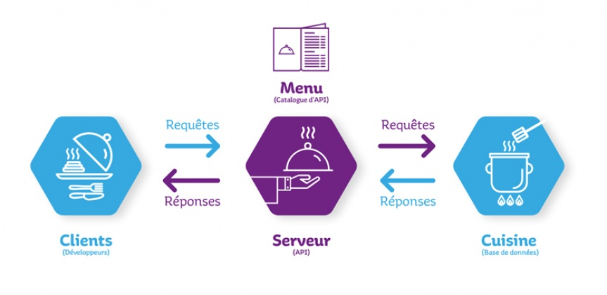 <!-- .element: height="50%" width="50%" -->

<!--v-->

### REST API

Representational state transfer (REST)

 <!-- .element: height="50%" width="50%" -->

<!--v-->

### Microservices vs "monoliths"

 <!-- .element: height="50%" width="50%" -->

PS: [Microservices are hard](https://dwmkerr.com/the-death-of-microservice-madness-in-2018/)

<!--v-->

### Multi applications & docker

 <!-- .element: height="50%" width="50%" -->

<!--v-->

### How does it relate to me ?

<!--v-->

### Hands-On

- **Backend** How to expose an ML model to a community of users through a web app
- **Frontend** How to build a companion app to interact with your model in an ergonomic fashion
- **Deployment** How to deploy both applications on a single instance

<!--v-->

In the data science workflow, 

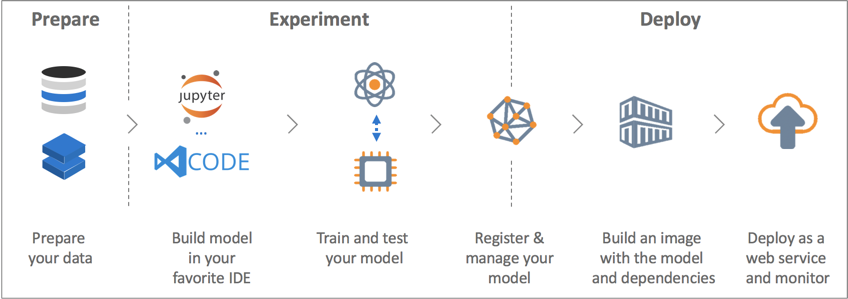  <!-- .element: height="50%" width="50%" -->

<!--v-->

I have an **awesome** ML model

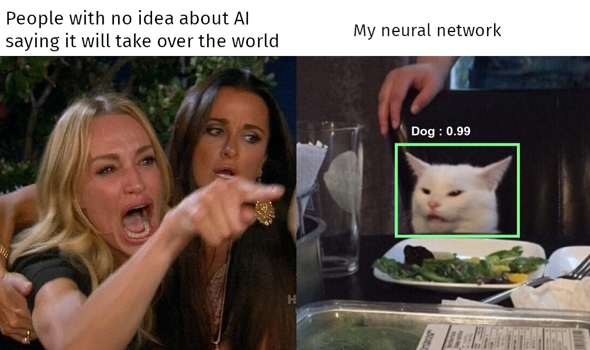  <!-- .element: height="50%" width="50%" -->

<!--v-->

(Just kidding)

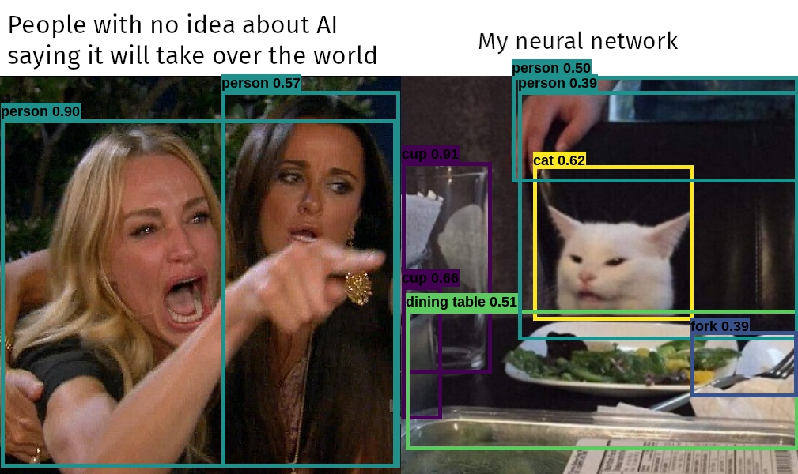  <!-- .element: height="50%" width="50%" -->

<!--v-->

I want to deploy it on the cloud for other to use

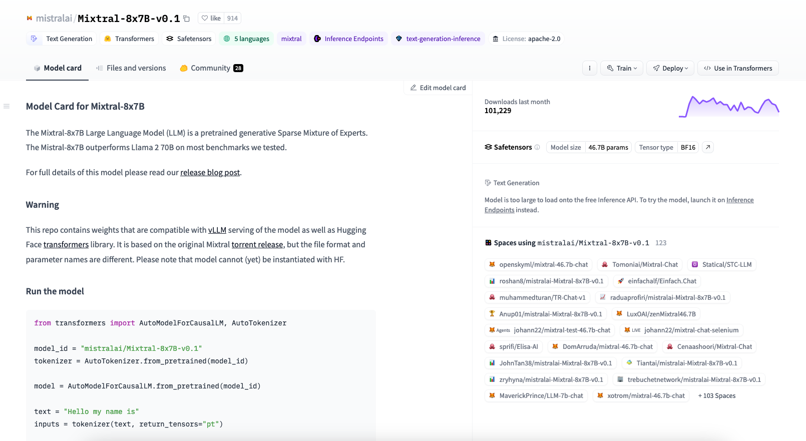  <!-- .element: height="50%" width="50%" -->

<!--v-->

Today we will do it by hand

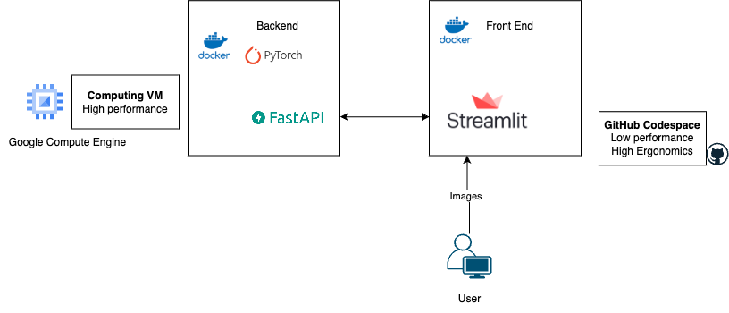  <!-- .element: height="50%" width="50%" -->

<!--v-->

Other methods for ML Model packaging behind a web server

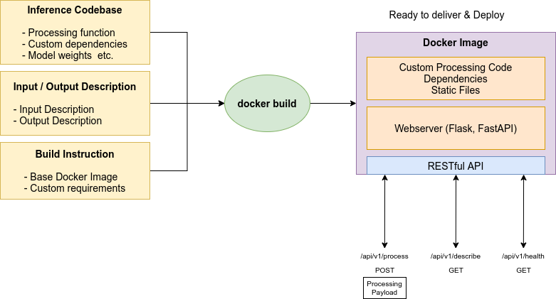

- cog : https://github.com/replicate/cog
- pesto : https://github.com/AirbusDefenceAndSpace/pesto
- litserve : https://github.com/Lightning-AI/LitServe

<!--v-->

Interaction with user ? We use CURL 👎 

```bash
curl -X POST "http://my-instance/predict" \
    -H  "accept: application/json" \
    -H  "Content-Type: application/json" \
    -d "{\"model\":\"string\",\"image\":\"...\"}"
```

<!--v-->

Interaction with user ? We use CURL 👎 

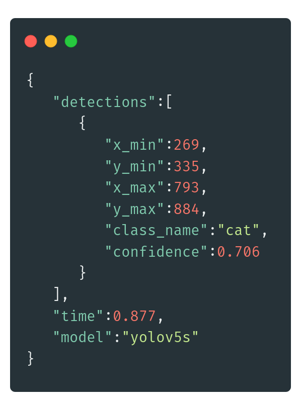  <!-- .element: height="30%" width="30%" -->

<!--v-->

Interaction with users ? 👍

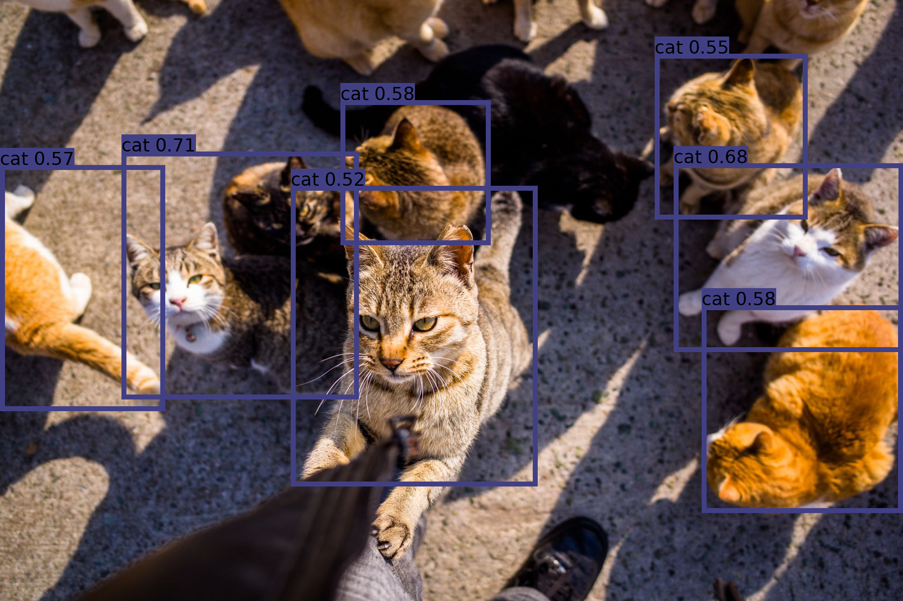  <!-- .element: height="50%" width="50%" -->

<!--v-->

Webapp builder for data scientists

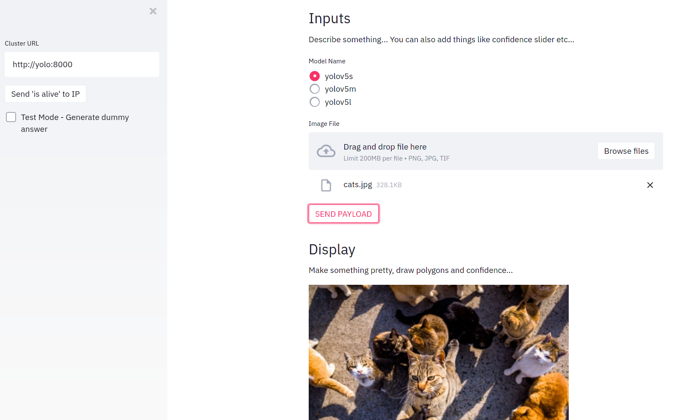  <!-- .element: height="50%" width="50%" -->


[you've seen it before](http://supaerodatascience.github.io/DE/1_4_be.html#6-lets-discover-streamlit)

<!--v-->

Webapp builder for data scientists

- [streamlit](https://streamlit.io/)
- [gradio](https://gradio.app/)

<!--v-->

Let's build it !

- A model behind a Restful API, packaged in a docker
- A frontend using streamlit, packaged in a docker
- Deploy it on Google Cloud Platform using GCE & docker-compose
- Send it to your friends !

<!--v-->

In reality, it's much more complex...

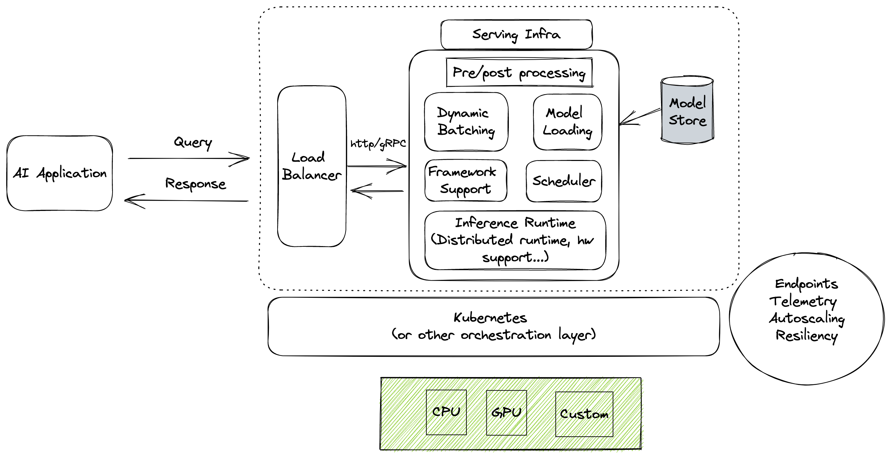  <!-- .element: height="50%" width="50%" -->

<!--v-->

How to scale deployment ?

- [CS229 - Class by Chip Huyen](https://docs.google.com/presentation/d/1U_zKs19VLJKnGE02JDRnzxJ8lgeVF22WSZ_GrA646fY/edit#slide=id.p)
- [CS229 - Deployment with Ray Serve](https://github.com/anyscale/academy/blob/main/ray-serve/e2e/tutorial.ipynb)
- https://docs.ray.io/en/latest/serve/develop-and-deploy.html

<!--v-->

Some links

- https://github.com/EthicalML/awesome-production-machine-learning
- Machine Learning System Designs https://stanford-cs329s.github.io/
