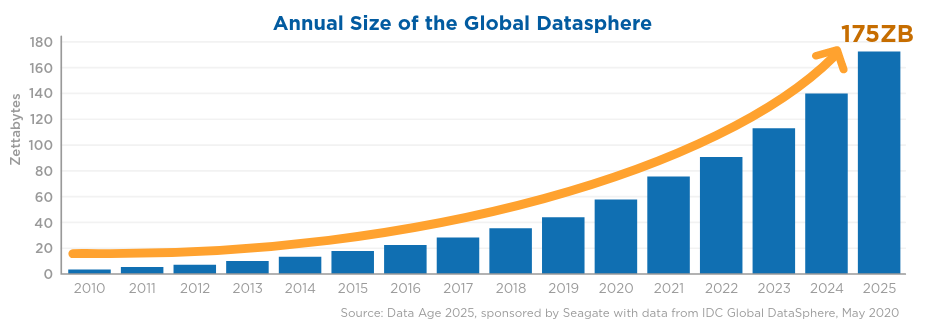
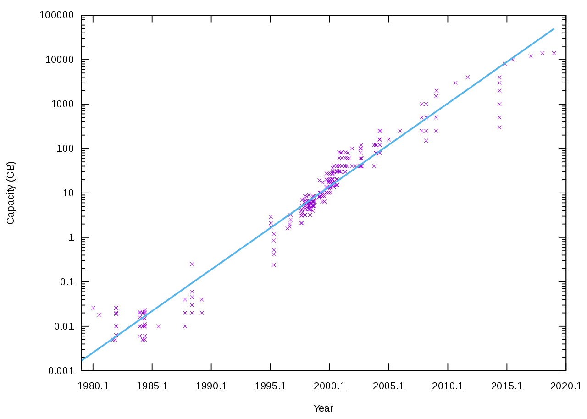
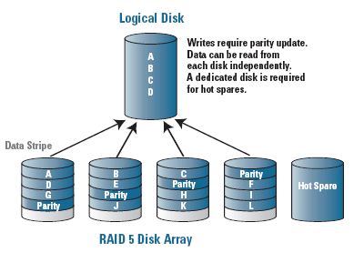
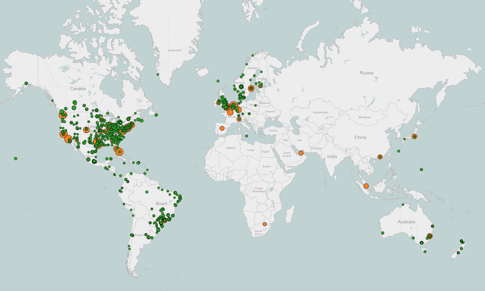
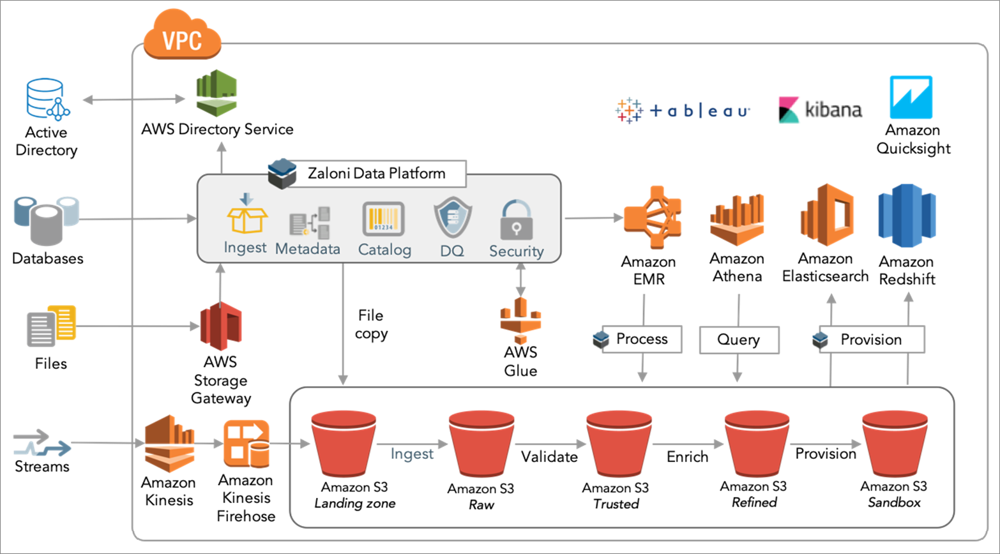
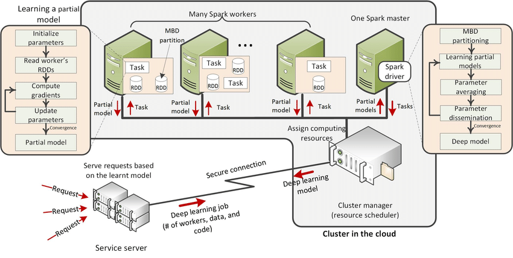
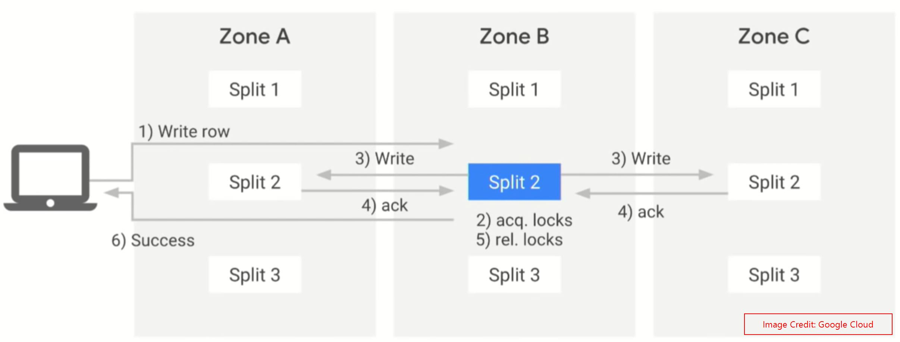
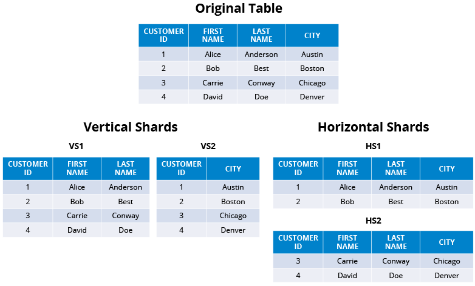
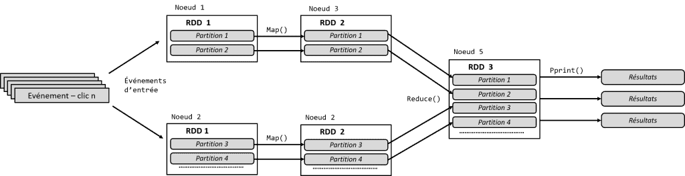
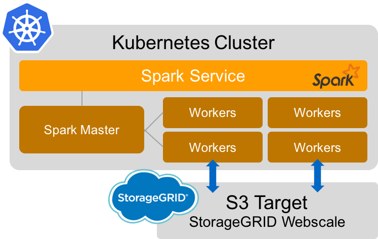

# Data Distribution

Overview

**ISAE-SUPAERO, SDD, January 2021**

Dennis WILSON

<!--s-->

## Schedule

| Data Distribution | | | Readings |
| --- | --- | --- | --- |
| [Data distribution](2_1_overview.md) | 1h | 06/01/2021 | [Spanner](https://github.com/SupaeroDataScience/DE/tree/master/readings/spanner.pdf) |
| [Functional programming](2_2_functional.md) | 4h | 06/01/2021 | [Julia](https://github.com/SupaeroDataScience/DE/tree/master/readings/julia.pdf) |
| [MapReduce and HDFS](2_3_mapreduce.md) | 3h | 19/01/2021 | [MapReduce](https://github.com/SupaeroDataScience/DE/tree/master/readings/mapreduce.pdf) |
| [Spark](2_4_spark.md) | 3h | 19/01/2021 | [Spark](https://github.com/SupaeroDataScience/DE/tree/master/readings/spark.pdf), [PySpark](https://spark.apache.org/docs/latest/api/python/pyspark.html) |
| [Dask on Kubernetes](2_5_dask.md)| 3h | 20/01/2021 | [Dask documentation](https://docs.dask.org/en/latest/setup/kubernetes.html) |
| [Dask project](2_6_project.md) | 6h | 27/01/2021 | [Dask](https://github.com/SupaeroDataScience/DE/tree/master/readings/dask.pdf) |

<!--s-->

## Why distribute data

Why not keep all data on a single file system on one drive?

<li>size of data set</li>
<li>data redundancy (having a backup)</li>
<li>data transfer latency</li>
<li>security, privacy</li>
<li>different needs for different parts of the architecture</li>
<li>parallelism of calculations</li>

<!--s-->

## Data Storage Capacity

 

[source](https://www.seagate.com/files/www-content/our-story/trends/files/idc-seagate-dataage-whitepaper.pdf), [source](https://commons.wikimedia.org/wiki/File:Hard_drive_capacity_over_time.svg)

Too much data to fit on one disk

<!--s-->

## RAID

Redundant Array of Independent Disks (originally "Inexpensive")

[RAID](https://en.wikipedia.org/wiki/RAID)

Allows for combining multiple disks for access as if they were one large disk. Reads and writes have different costs and data operations are managed by an overhead process. Parallel writes to different data sections not possible.

Also allows for same-site data redundancy so drives can be lost or corrupted without data loss.

<!--s-->

## Data Transfer Rates

With clients around the world, data must be stored near to clients to reduce data transfer time. Image: Netflix's OpenConnect network, which is their primary means of serving video content. Servers cache (store in memory) the most popular or relevant content and serve clients from these caches.

[source](https://about.netflix.com/en/news/how-netflix-works-with-isps-around-the-globe-to-deliver-a-great-viewing-experience)

<!--s-->

## Security, Privacy

Different geographic zones have different data laws.

GDPR stipulates storing only what personal data is necessary, which can apply to specific zones.

Good security practice to have multiple copies of secure data in different areas.

<!--s-->

## System Architecture Requirements

Different parts of the architecture access different parts of the total data storage, use different sets of operations.

Distributing data allows for specifically configured access, manipulation, and storage operations for different parts of the network.

[source](https://aws.amazon.com/blogs/apn/turning-data-into-a-key-enterprise-asset-with-a-governed-data-lake-on-aws/)

<!--s-->

## Parallelization

Distributing data allows for parallelizing computational resources for high-compute tasks.

Source: Alsheikh, Mohammad Abu, et al. "Mobile big data analytics using deep learning and Apache Spark." IEEE network 30.3 (2016): 22-29.

<!--s-->

## Computing over distributed data

Goals of distributed computing:

+ Ensure synchronization of redundant information
+ Minimize unnecessary data transfer
+ Maximize parallel compute capacity
+ Fault tolerant, consensus can be acheived even if some workers crash or drop messages

<!--s-->

## Paxos

PROPOSERS:
+ Submit a proposal numbered nnn to a majority of acceptors. Wait for a majority of acceptors to reply.
+ If the majority reply ‘agree’, they will also send back the value of any proposals they have already accepted. Pick one of these values, and send a ‘commit’ message with the proposal number and the value. If no values have already been accepted, use your own. If instead a majority reply ‘reject’, or fail to reply, abandon the proposal and start again.
+ If a majority reply to your commit request with an ‘accepted’ message, consider the protocol terminated. Otherwise, abandon the proposal and start again.

ACCEPTORS:
+ Once a proposal is received, compare its number to the highest numbered proposal you have already agreed to. If the new proposal is higher, reply ‘agree’ with the value of any proposals you have already accepted. If it is lower, reply ‘reject’, along with the sequence number of the highest proposal.
+ When a ‘commit’ message is received, accept it if a) the value is the same as any previously accepted proposal and b) its sequence number is the highest proposal number you have agreed to. Otherwise, reject it.

L. Lamport, The part-time parliament, Research Report 49, Digital Equipment Cor-poration Systems Research Center, Palo Alto, CA, September 1989.

<!--s-->

## Paxos

[source](https://www.the-paper-trail.org/post/2009-02-03-consensus-protocols-paxos/)

<!--s-->

## Spanner

Corbett, James C., et al. "Spanner: Google’s globally distributed database." ACM Transactions on Computer Systems (TOCS) 31.3 (2013): 1-22.

<!--s-->

## Data Sharding

Splitting large datasets into "shards" stored on different nodes

<!--s-->

## Distributing high-level computation

Distributed database priorities:
+ Ensure data integrity (synchronization between workers)
+ Efficient reads
+ As efficient of writes as consensus permits

High-level distributed computation:
+ Perform a sum or count over a feature on all individual shards
+ Mutliply sums from different instances together
+ Compute a matrix operation for data stored on multiple nodes
+ Apply a transformation to entire dataset over multiple nodes
+ Prioritize efficiency

<!--s-->

## Spark

Zaharia, Matei, et al. "Resilient distributed datasets: A fault-tolerant abstraction for in-memory cluster computing." Presented as part of the 9th {USENIX} Symposium on Networked Systems Design and Implementation ({NSDI} 12). 2012.

<!--s-->

## Orchestration

Configuring the storage, access, and computational workers: orchestration software like Kubernetes.

<!--s-->

## MapReduce

Fundamental idea: In order to send operations to different workers, we need to be able to pass operations (functions), return them from functions, store them.

In other words, we require **first-class functions**. This is a feature of functional programming.
