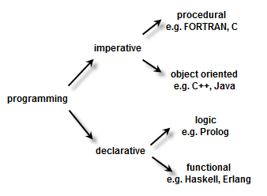
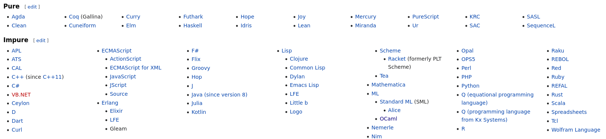

# Functional Programming

**ISAE-SUPAERO, SDD, January 2021**

Dennis WILSON

<!--s-->

## Functional Programming Features

+ **Pure Functions** - do not have side effects, that is, they do not change the state of the program. Given the same input, a pure function will always produce the same output.
+ **Immutability** - data cannot be changed after it is created. Take for example creating a List with 3 items and storing it in a variable `my_list`. If `my_list` is immutable, you wouldn't be able to change the individual items. You would have to set `my_list` to a new list if you'd like to use different values.
+ **Higher Order Functions** - functions can accept other functions as parameters and functions can return new functions as output. This allows us to abstract over actions, giving us flexibility in our code's behavior.

For full higher-order functionality, functions must be able to be represented as variables, ie functions must be first-class citizens.

<!--s-->

## Functional Programming Taxonomy



Imperative programming : uses statements that change a program’s state.

Declarative programming : expresses the logic of a computation without describing its control flow.

<!--s-->

## Functional Programming Languages



[source](https://en.wikipedia.org/wiki/List_of_programming_languages_by_type)

<!--s-->

## Functional Programming as design

Object-orientation is orthogonal to imperative/functional style. A language is more or less functional depending on its support for functional programming designs.

for instance:
+ Java is imperative and object-oriented
+ C++is imperative and object-oriented
+ Scala is functional and object-oriented
+ OCaml defines an object-oriented layer on a functional core
+ Smalltalk is functional and object-oriented
+ Julia is functional and object-oriented
+ Python is usually imperative and object-oriented but is flexible
+ ...

<!--s-->

## Scala

Scala is an object-oriented and functional language and is the native language of Apache Spark.

Scala can be considered as a more "functional" language than Julia.

Slides and exercise in Scala from previous years are [here](https://lms.isae.fr/course/view.php?id=1226&section=5).

```
def twice(f:Int=>Int) = f compose f

twice(_+3)(7) // 13
```

<!--s-->

## Python

+ Python encourages object-oriented design through Classes and inheritance
+ Bytecode of functions can be stored through pickling, but functions cannot be directly stored
+ Functions do not have first-class support, they must use pointers to `lambda` functions
+ Scope of lambda functions limited
+ Improved support for functional programming with [functools](https://docs.python.org/3.8/library/functools.html#module-functools), but main design principles in Python focused on object-oriented

```
>>> def twice(f):
...     def result(a):
...         return f(f(a))
...     return result

>>> plusthree = lambda x: x + 3

>>> g = twice(plusthree)
    
>>> g(7)
13
```

<!--s-->

## Julia

+ Not a "pure" functional language, includes some object-oriented design principles (`struct`)
+ Functions are first-class citizens
+ Native support of function broadcast using `.`
+ Easy parallel processing and distributed computing
+ Other motivations for learning: it is fast, it is increasingly used for Machine Learning, it's a part of our favorite tool Jupyter (Julia, Python, R), it's fun!

```
julia> function twice(f)
           function result(a)
               return f(f(a))
               end
           return result
       end
twice (generic function with 1 method)

julia> plusthree(x) = x + 3
plusthree (generic function with 1 method)

julia> g = twice(plusthree)
(::var"#result#3"{typeof(plusthree)}) (generic function with 1 method)

julia> g(7)
13
```

<!--s-->

## Exercise

Install Julia and IJulia locally or get a working Julia Colab Notebook

https://github.com/JuliaLang/IJulia.jl

https://colab.research.google.com/github/ageron/julia_notebooks/blob/master/Julia_Colab_Notebook_Template.ipynb

https://github.com/ageron/julia_notebooks

**then**

Julia for Pythonistas

https://github.com/ageron/julia_notebooks/blob/master/Julia_for_Pythonistas.ipynb

https://colab.research.google.com/github/ageron/julia_notebooks/blob/master/Julia_for_Pythonistas.ipynb

<!--s-->

## Next Class

Distributed MapReduce for matrix operations in Julia
