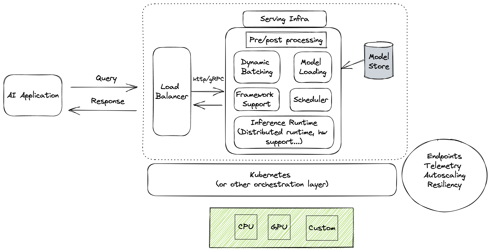

## Containers Orchestration


<!--v-->

You just deployed your ML model in production **on one machine** <!-- .element: class="fragment" data-fragment-index="1" -->

<!--v-->

#### Questions

Suppose I have a large pool of machines available

* How do I **deploy my container on all machines ?** <!-- .element: class="fragment" data-fragment-index="1" -->
* How do I **put the right containers at the right spot ?** <!-- .element: class="fragment" data-fragment-index="2" -->
* How do I **scale (up and down) to demand ?** <!-- .element: class="fragment" data-fragment-index="3" -->
* How do I **expose the http endpoints ?** <!-- .element: class="fragment" data-fragment-index="4" -->
* How do I **manage failure of containers ?** <!-- .element: class="fragment" data-fragment-index="5" -->
* How do I **update my model without downtime** <!-- .element: class="fragment" data-fragment-index="6" -->

<!--v-->

### In reality, it's much more complex...

  <!-- .element: height="50%" width="50%" -->

<!--v-->

### Orchestration


<!--v-->

#### The next step


<!--v-->

#### Orchestration

- containers are a lightweight mechanism for isolating an application's environment
- specify the system configuration and libraries to install
- avoid conflicts with other applications
- each application as a container image which can be executed reliably on any machine
- place multiple workloads on the same physical machine or distributed over many machines
- orchestration for fail cases of containers or machines
- allow for updates without downtime by creating new containers

<!--v-->

### Orchestration Design Principles

- **Declarative** - describe ideal system state
- **Distributed** - use multiple machines for scale & properly use each machine resources
- **Microservice** - decouple applications into individual services
- **Immutable** - Change image versions, not instances

<!--v-->

### Examples...

- Docker Swarm
- CoreOS Fleet
- [Apache Mesos](https://mesos.apache.org/) / [Marathon](https://github.com/mesosphere/marathon)

... and so many more !


<!--v-->


<!--s-->

### Kubernetes ("Helmsman")


<!--v-->

 <!-- .element: height="30%" width="30%" -->

Kubernetes (or k8s) comes from Google's internal systems [Borg](https://github.com/SupaeroDataScience/DE/blob/master/readings/borg.pdf)

It is open source now <https://github.com/kubernetes> and used... everywhere ?

<!--v-->

### [Kubernetes](https://kubernetes.io/docs/concepts/overview/what-is-kubernetes/)


Kubernetes manages your containers on a cluster of machine while taking care of 

- Creation, deletion, and movement of containers
- Scheduling (match containers to machines by ressources etc.)
- Scaling of containers
- Serving of containers through unified endpoints
- Monitoring and healing

<!--v-->

Kubernetes is part of [Cloud Native Computing Foundation](https://www.cncf.io/)

 <!-- .element: height="40%" width="40%" -->

> As part of the Linux Foundation, we provide support, oversight and direction for fast-growing, cloud native projects, including Kubernetes, Envoy, and Prometheus.

<!--v-->

[Cloud Native Computing Foundation Landscape](https://landscape.cncf.io/) 

 <!-- .element: height="50%" width="60%" -->

<!--v-->

[Cloud Native Computing Foundation Projects](https://landscape.cncf.io/)

 <!-- .element: height="30%" width="30%" -->

<!--v-->

😱 😱 😱 😱

 <!-- .element: height="40%" width="40%" -->

<!--v-->

🤗 🤗 🤗

  <!-- .element: height="40%" width="40%" -->

<!--v-->

Pods

  <!-- .element: height="50%" width="50%" -->

<!--v-->

Pods, Nodes

 <!-- .element: height="50%" width="50%" -->

<!--v-->

Endpoints

 <!-- .element: height="50%" width="50%" -->

<!--v-->

Updating

 <!-- .element: height="50%" width="50%" -->

<!--v-->

"Declarative" programming, cloud agnostic


<!--v-->

"Declarative" programming : Welcome to YAML

`kubectl apply -f deployment.yaml`


<!--v-->

"Declarative" programming : Welcome to YAML

`kubectl apply -f deployment.yaml`

```yaml
apiVersion: apps/v1
kind: Deployment
metadata:
  name: nginx-deployment
  labels:
    app: nginx
spec:
  replicas: 3
  selector:
    matchLabels:
      app: nginx
  template:
    metadata:
      labels:
        app: nginx
    spec:
      containers:
      - name: nginx
        image: nginx:1.14.2
        ports:
        - containerPort: 80
```

<!--v-->

  <!-- .element: height="50%" width="50%" -->

Example: <https://artifacthub.io/packages/helm/dask/dask>

<!--v-->

GCP + k8s = ❤️‍

 <!-- .element: height="50%" width="50%" -->

<!--v-->


[comic](https://cloud.google.com/kubernetes-engine/kubernetes-comic/)

<!--v-->

Play with k8s

<https://www.katacoda.com/courses/kubernetes>

<https://labs.play-with-k8s.com/>

<https://github.com/yogeek/kubernetes-local-development>
